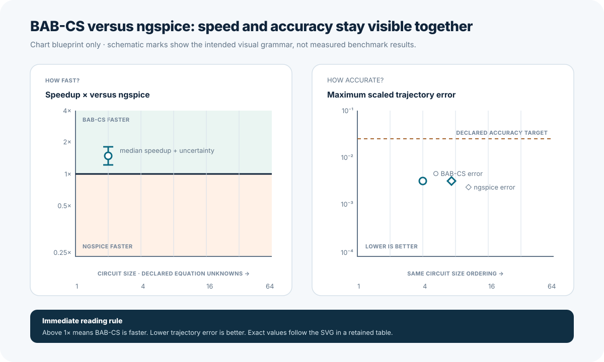

# BAB-CS Same-Machine ngspice Runtime Benchmark Plan

**Status:** Implemented and validated on August 28, 2026
**Prepared:** August 27, 2026

## Purpose

This plan defines a fair, reproducible runtime comparison between
Bounded-Authority-Based-Circuit-Simulation (`BAB-CS`) and ngspice. BAB-CS is a
circuit-simulation architecture in which a candidate numerical method proposes
the next state while separate authority checks decide whether that state is
accepted. ngspice is an independent simulator from the Simulation Program with
Integrated Circuit Emphasis (`SPICE`) family.

The benchmark shall run both tools:

- on the same physical machine;
- on semantically identical circuits;
- from the same start time to the same stop time;
- with identical component values, initial conditions, source schedules, and
  event times;
- with either one declared common maximum timestep or independently selected
  maximum timesteps that satisfy one common accuracy target and sample grid; and
- under one recorded environment and one interleaved run schedule.

The suite shall record median runtime, accepted and output points, native solver
work, peak memory, and trajectory error. Its headline figure shall show BAB-CS
speedup relative to ngspice against circuit size, with trajectory accuracy in an
adjacent panel rather than hidden in a table or appendix.

## Success Definition

The implementation is complete only when one command can produce:

1. a machine-readable raw measurement record containing every timed sample;
2. a normalized result table with one matched BAB-CS/ngspice row per case and
   size;
3. a solver-work table that preserves each tool's native counters;
4. a peak-memory table using one operating-system measurement method;
5. a trajectory-accuracy table evaluated on one common sample grid;
6. an accessible Scalable Vector Graphics (`SVG`) headline chart showing
   speedup and accuracy side by side;
7. a professional Markdown report explaining the result and its limits; and
8. tests proving that no case, failed run, poor-accuracy result, or unfavorable
   speed result can disappear from the published output.

Runtime evidence is local characterization. It shall not become a universal
performance claim, correctness gate, release gate, or claim that ngspice is an
exact physical oracle.

## Current Repository Baseline

The repository already provides:

- `benchmarks/external/manifest.json`, which owns 20 semantically mapped cases;
- `tools/compare_external.py`, which generates ngspice netlists and compares
  trajectories;
- `tools/run_external_suite.py`, which executes the complete mapped inventory;
- `tools/compare_methods.py`, which separates deterministic numerical reports
  from local timing reports;
- `src/babcs/io.py::summary_data`, which records accepted steps, rejected
  attempts, candidate and reference work, projections, Jacobian evaluations,
  and replay work;
- `benchmarks/external/reference-results.json`, which retains the reviewed
  20-case trajectory differences; and
- deterministic HTML and SVG generation for documentation.

The missing surface is a matched external runtime harness. The current ngspice
suite records tool identity, output rows, artifacts, and trajectory differences,
but it does not retain repeated runtime samples, peak resident memory, ngspice
accepted/rejected timepoints, ngspice transient iterations, or size-scaling
families.

## Implemented Accuracy and Profile Correction

The August 28, 2026 correction loop adds two explicit accuracy modes:

- `fixed_config` applies the shared case maximum timestep and reports the
  resulting accuracy without implying that the two methods perform equal work;
  and
- `fixed_accuracy` independently refines each tool's maximum timestep against
  one qualified authority and retains the first target-qualified bounded
  configuration.

The fixed-accuracy supervisor now records every calibration attempt, selected
timestep divisor, native work, point counts, trajectory error, and bounded
failure reason. Analytic authorities are used for supported RC, RL, and
scheduled switched-RC families. Refined authorities must agree with a
half-refined authority within the declared convergence cap. Estimated point and
trace-value budgets stop unsafe calibration before a child process is launched.

The runtime manifest also owns named BAB-CS operating profiles. Smooth linear
and coupled-linear families use `active_heun_deferred4_smooth`; scheduled
switching uses `active_ab2_deferred4_events`; and diode families retain
`active_ab2_reference1_nonlinear` until nonlinear authority convergence is
proven. Generated cases record the selected profile, installed-wheel workers
record the complete effective configuration, and report validation requires the
manifest, source case, and installed wheel to agree.

## Non-Negotiable Comparison Contract

### Same machine

Every compared pair shall come from one benchmark invocation on one named
machine. BAB-CS results from one computer shall never be divided by ngspice
results from another computer.

The environment record shall include:

- processor model, physical and logical core counts, and selected processor
  affinity;
- operating-system kernel and architecture;
- total physical memory;
- processor-frequency governor when readable;
- Python implementation and version;
- exact BAB-CS commit, source-tree hash, wheel hash, and installed-module path;
- ngspice executable path, version, build date, and reported linear solver;
- GNU Time version used for peak-memory measurement;
- relevant thread-count environment variables; and
- whether the source tree was dirty.

The required single-thread environment shall set variables such as
`OMP_NUM_THREADS`, `OPENBLAS_NUM_THREADS`, `MKL_NUM_THREADS`, and
`NUMEXPR_NUM_THREADS` to `1`. If affinity, governor, or thread control cannot be
confirmed, the report shall state that limitation rather than infer it.

### Same circuit

One canonical case input shall own both executions. The ngspice netlist shall be
generated from that input through the existing semantic mapper. The report shall
retain the case Secure Hash Algorithm 256-bit (`SHA-256`) fingerprint and the
generated netlist SHA-256 fingerprint.

The runner shall verify equality of:

- declared elements and values;
- node orientation;
- source waveforms and scheduled breakpoints;
- capacitor-voltage and inductor-current initial conditions;
- start and stop times;
- requested maximum timestep; and
- canonical dynamic-state order.

Unsupported mappings shall fail closed. Fail closed means stop with an explicit
error instead of guessing or silently simplifying the model.

### Same stop time

The stop time shall be read once from the canonical case and passed unchanged to
both tools. A completed row must prove that each accepted trajectory reaches that
stop time within a tolerance derived from floating-point spacing. A truncated
trajectory is an execution failure, not a faster result.

### Same declared temporal resolution or accuracy

The fixed-config profile shall apply the same declared maximum timestep to
BAB-CS and the ngspice transient deck. Each solver may take smaller internal
steps according to its own method. Those choices remain visible through accepted
and rejected point counts.

The fixed-accuracy profile shall preserve the same circuit, start time, stop
time, authority, evaluation grid, and error target while independently selecting
each tool's maximum timestep. It shall report both selected timesteps beside
runtime so accuracy cost is visible rather than hidden.

The report shall not describe equal maximum timesteps as equal solver work.
BAB-CS and ngspice use different acceptance, interpolation, nonlinear, and
authority paths.

## Benchmark Inventory

### Tier A: semantic-breadth suite

All 20 cases in `benchmarks/external/manifest.json` shall run in the required
same-machine suite. This preserves the existing coverage of:

- resistor-capacitor (`RC`) and resistor-inductor (`RL`) transients;
- inductor-capacitor (`LC`) and resistor-inductor-capacitor (`RLC`) behavior;
- nonlinear diode circuits;
- scheduled switching; and
- three reduced-order power-stage experiments.

These 20 rows characterize engineering breadth. They are not sufficient by
themselves for a clean size-scaling chart because most contain only one or two
dynamic states.

### Tier B: size-scaling spine

Add `benchmarks/runtime/manifest.json` and deterministic generated cases for
five circuit families:

| Family | Behavior | Required size parameter |
| --- | --- | ---: |
| `rc_bank` | repeated linear charging channels | channels |
| `coupled_rc_ring` | grounded nearest-neighbor coupled resistor-capacitor network | coupled nodes |
| `rl_bank` | repeated current-state buildup channels | channels |
| `diode_rc_bank` | repeated nonlinear diode channels | channels |
| `switched_rc_bank` | repeated state channels plus shared scheduled events | channels |

The required full sizes are `1`, `2`, `4`, `8`, `16`, `32`, and `64`. A quick
profile may use `1`, `4`, and `16`. An explicitly opt-in stress profile may add
`128` and `256` after runtime and memory limits are measured.

Each family shall preserve its electrical time constants, source shape, event
count, stop time, nominal maximum timestep, and comparison sample count as size
changes. Increasing size must add equations, not silently change the physical
duration or make the larger case easier by shortening the experiment.

Four families use repeated independently loaded channels that share an ideal
source and, where applicable, one event schedule. These banks are intentionally
retained as a replication-throughput baseline: they show the cost of adding
more states without adding stronger state-to-state coupling. They must not be
presented alone as evidence of general circuit scaling.

The `coupled_rc_ring` family adds genuine nearest-neighbor interactions. Only
the first node is directly driven, every node retains a grounded shunt path, and
larger cases add coupled modes while preserving a bounded time-constant
envelope. This corrects the original scaling inventory's main circuit-model
deficiency without pretending that one linear coupled family represents all
large circuits. The original ungrounded ladder proposal remains rejected because
its changing spectrum made size and physical difficulty inseparable.

Generated cases shall be owned by `tools/generate_runtime_cases.py`. The
generator shall write stable JSON files under `benchmarks/runtime/cases/`, and a
test shall prove that regeneration is byte-identical. If a proposed topology
violates BAB-CS topology constraints or cannot be mapped exactly to ngspice, the
generator shall fail and the family shall be corrected explicitly rather than
silently omitted.

### Canonical circuit-size measure

The headline horizontal axis shall use:

```text
declared MNA unknowns = dynamic-state count + BAB-CS algebraic-unknown count
```

Modified nodal analysis (`MNA`) is the circuit-equation formulation that solves
node voltages, selected branch currents, and energy-storage states. The declared
MNA count provides one stable size value shared by both tools because it comes
from the common model rather than either solver's internal optimization.

Every row shall additionally record:

- element count;
- non-ground node count;
- dynamic-state count;
- BAB-CS algebraic-unknown count;
- declared total MNA unknowns; and
- ngspice `Circuit Equations` from `rusage all`.

If the two equation counts differ, both values remain visible. The chart still
uses the declared common-model count so one case cannot move horizontally
between panels.

## Tool Profiles

### Headline BAB-CS profile

The headline profile shall be the installed-wheel active bounded configuration
declared by each case through a named runtime-manifest profile. It shall preserve
candidate proposal, projection, reference authority, rejection gates, fallback,
and periodic replay. The benchmark must not disable authority work merely to
obtain a favorable speedup. Every row shall retain the profile identifier,
declared overrides, complete effective configuration, and installed-wheel
configuration-equality proof.

The publication baseline explicitly selects the deterministic `dense` BAB-CS
linear backend. Two additional installed-wheel profiles make backend scaling
visible rather than changing the headline silently:

- `scipy` uses explicit SciPy sparse algebra for every case and records NumPy
  and SciPy versions and import paths;
- `hybrid` uses dense algebra below 18 declared MNA unknowns and explicit SciPy
  sparse algebra at or above that reviewed crossover.

The package-level `auto` backend is not a benchmark profile. Measurement showed
that repeated backend-selection and density inspection made it slower than both
explicit alternatives on this inventory. The benchmark therefore resolves the
hybrid policy once per case and passes an explicit backend to both source and
installed-wheel execution.

The supervisor shall build the wheel from the exact source commit, install it in
an isolated environment, clear source-tree import paths, and prove
`source_tree_excluded: true` before timing.

### Contextual BAB-CS profile

An optional second report may include a named implicit-authority-only BAB-CS
profile, such as trapezoidal disabled mode. This contextual row helps separate
core integration cost from bounded-authority cost. It shall never replace the
active bounded headline profile.

### ngspice profile

The ngspice profile shall use the generated semantic netlist with all options
recorded explicitly. The runner shall record the actual linear solver named in
the log. It shall not select different hidden ngspice options for different
sizes unless the manifest names separate profiles.

## Measurement Model

### Two runtime scopes

The suite shall retain two runtime measures because either measure alone can be
misleading.

1. **Analysis-only runtime** measures the transient simulation itself after
   parsing and initialization and before report serialization.
2. **End-to-end process runtime** measures fresh-process startup, input parsing,
   simulation, and required output generation.

The headline speedup chart shall use analysis-only runtime. End-to-end speedup
shall be reported in a secondary table and optional companion figure.

For BAB-CS, a small installed-wheel benchmark worker shall call
`time.perf_counter_ns()` immediately around `Simulator.run`. For ngspice, the
netlist shall execute `rusage all` immediately after `tran` and before `wrdata`;
the parser shall retain `Total analysis time (seconds)` and the transient timing
subfields.

The outer supervisor shall measure end-to-end elapsed time with
`time.perf_counter_ns()` around each child process. Both tools shall be launched
through the same supervisor and process-affinity path.

### Warmups, repeats, and interleaving

The publication profile shall use:

- five unreported warmups per tool and case;
- three balanced rounds;
- fifteen timed paired executions per round and tool; and
- a deterministic alternating order such as `BAB-CS, ngspice, ngspice,
  BAB-CS` across adjacent pairs.

The full development profile may use three warmups and eleven paired repeats.
The continuous-integration smoke profile may use one warmup and three repeats on
two small cases, but its timing values shall not be published as performance
evidence.

For each metric, retain every sample and report:

- median;
- minimum and maximum;
- 25th and 75th percentiles; and
- a deterministic-seed bootstrap 95-percent interval for the median when at
  least eleven samples exist.

Bootstrap resampling repeatedly draws replacement samples from the measured
runtimes to estimate how much the median could vary. A fixed random seed makes
the interval calculation reproducible from one retained sample set.

The median is the required headline statistic. Mean runtime may be retained for
diagnosis but shall not replace the median.

### Benchmark isolation

Before a publication run, the operator shall:

- close unrelated compute-heavy workloads;
- connect the machine to stable power;
- select one processor core or one documented core set;
- prevent concurrent benchmark rows;
- use local temporary storage;
- prebuild the BAB-CS wheel and ngspice netlists before timed rounds; and
- record whether frequency scaling or turbo behavior could not be controlled.

The suite shall not flush operating-system caches between every run. Warmups
create a stable warm-cache characterization for both tools. A separate cold
startup study may be added later under a different profile name.

## Required Metrics

### Median runtime

For each tool, case, size, and profile, report:

- median analysis-only seconds;
- median end-to-end seconds;
- all raw samples and distribution summaries; and
- paired execution order.

The headline speedup is:

```text
speedup_x = median_ngspice_analysis_seconds / median_babcs_analysis_seconds
```

Interpretation shall be printed directly in the report:

- `speedup_x > 1`: BAB-CS was faster on this measured row;
- `speedup_x = 1`: measured parity; and
- `speedup_x < 1`: ngspice was faster.

No percentage-only wording may replace the multiplicative value.

### Accepted and output points

The suite shall distinguish four counts:

1. BAB-CS accepted timepoints, including the initial point;
2. ngspice accepted and rejected timepoints from `rusage all`;
3. each tool's native exported output rows; and
4. common accuracy-grid sample count.

These counts shall not be collapsed. A solver can take many internal accepted
points but export a smaller trace, or export interpolated values that are not
internal acceptance points.

### Solver work

BAB-CS shall retain its existing native counters, including:

- accepted and rejected steps;
- candidate and reference solves, iterations, and circuit evaluations;
- algebraic iterations;
- projection iterations;
- differential-Jacobian evaluations;
- implicit fallbacks; and
- replay steps, evaluations, and iterations.

The ngspice `rusage all` parser shall retain at least:

- total and transient iterations;
- circuit equations;
- transient, accepted, and rejected timepoints;
- matrix load, reorder, factor, and solve times; and
- total and transient analysis time.

Native counters shall be reported side by side and normalized per accepted
timepoint where meaningful. The suite shall not invent one universal solver-work
unit by adding unlike BAB-CS and ngspice operations together.

If an ngspice version omits a required counter, the result shall say
`unsupported_counter`; it shall not substitute zero.

### Peak memory

Peak memory shall use one operating-system-level measure for both fresh child
processes: maximum resident set size (`RSS`). Resident set size is the physical
memory resident for a process at its peak.

The supervisor shall wrap each tool with GNU Time and collect `%M`, which
reports maximum resident memory in kibibytes on the target Linux environment.
Runtime shall still come from `perf_counter_ns`; GNU Time's formatted elapsed
value shall not be used for subsecond measurements.

Report:

- every per-run maximum RSS sample;
- median maximum RSS;
- maximum observed RSS; and
- ngspice's internal `Maximum ngspice program size` as supplementary evidence.

Python-only allocation tracers shall not be used as the cross-tool memory
metric because they omit native-library and interpreter memory.

### Trajectory accuracy

Both tools shall be evaluated on one fixed common sample grid generated from the
canonical start and stop times. Tool-native traces shall be interpolated only
for evaluation; interpolation shall not change accepted-point or output-row
counts.

ngspice transient output produced with `uic` can begin at its first positive
accepted time rather than at the declared initial time. When that occurs, the
accuracy evaluator shall prepend the canonical initial dynamic state at the
declared start time for interpolation only. The native ngspice output-row and
accepted-timepoint counts remain unchanged, and the matched row shall record
`ngspice_evaluation_initial_point_injected: true`.

ngspice `wrdata` times are printed with finite decimal precision. A requested
stop time may therefore round by a few trillionths of a second in the retained
text. Boundary comparison and interpolation shall use a documented tolerance
derived from the printed time magnitude; the requested stop time, retained
time, and absolute difference remain visible.

Each benchmark family shall name one independent trajectory authority:

- analytic authority for supported linear RC, RL, LC, and RLC families; or
- independently refined replay for nonlinear and switched families.

ngspice shall not be treated as the authority merely because it is the external
tool.

For each tool, retain:

- final-state maximum absolute error;
- maximum pointwise absolute error per state;
- root-mean-square waveform error per state;
- maximum scaled trajectory error; and
- phase, period, amplitude, and energy metrics where applicable.

Scaled trajectory error shall be dimensionless:

```text
abs(value - authority) /
  (absolute_tolerance + relative_tolerance * max(abs(value), abs(authority)))
```

The report shall also retain the direct BAB-CS-versus-ngspice trajectory
difference as cross-implementation evidence, but it shall not label that
difference exact physical error.

## Artifact and Schema Design

Add `benchmarks/schemas/runtime-benchmark-v1.schema.json`. Required artifacts
shall be:

```text
benchmarks/runtime/
  manifest.json
  cases/
    *.json

artifacts/runtime/
  raw-samples.json
  matched-results.json
  matched-results.csv
  solver-work.csv
  memory.csv
  speedup-accuracy-by-size.svg
  memory-by-size.svg
  points-and-work-by-size.svg
  report.md
  logs/
    <row-id>-babcs.json
    <row-id>-ngspice.log
    <row-id>-ngspice.dat
    <row-id>.cir
```

Each matched result shall include:

- stable row identity;
- case and family identity;
- size and equation counts;
- exact tool profiles and hashes;
- stop-time and timestep proof;
- raw timing and memory samples;
- medians and intervals;
- accepted/output/common-grid point counts;
- native solver-work objects;
- per-tool authority errors;
- direct cross-tool differences;
- speedup; and
- explicit status and failure reason.

JavaScript Object Notation (`JSON`) shall own nested evidence. Comma-separated
values (`CSV`) shall provide reviewable flat tables. SVG shall own the chart.
Markdown shall explain the result. Timing values are not expected to reproduce
byte-for-byte, but rendering the same retained JSON shall reproduce identical
CSV, SVG, and Markdown bytes.

## The Headline Chart

The required chart is `speedup-accuracy-by-size.svg`.



The blueprint above fixes the reading order before measurements exist. It is
explicitly illustrative and shall never be published as benchmark evidence.
The measured generator shall retain the same two-panel grammar while replacing
every schematic mark with values from `matched-results.json`.

### Layout

Use two adjacent panels with matching circuit-family colors and the same circuit
size ordering.

**Left panel: “How fast?”**

- horizontal axis: declared total MNA unknowns;
- vertical axis: BAB-CS speedup versus ngspice in multiples;
- logarithmic speedup scale with clearly labeled values such as `0.25×`,
  `0.5×`, `1×`, `2×`, `4×`, and `8×`;
- a strong `1×` parity line;
- a lightly shaded region labeled `BAB-CS faster` above parity;
- a lightly shaded region labeled `ngspice faster` below parity; and
- median points with uncertainty whiskers.

**Right panel: “How accurate?”**

- horizontal axis: the same declared total MNA unknowns;
- vertical axis: maximum scaled trajectory error, with `lower is better` in the
  axis title;
- separate BAB-CS and ngspice markers for every matching row;
- a declared accuracy-target line when the manifest provides one; and
- failure or unavailable-authority markers that remain visible rather than
  disappearing.

The chart shall not use a dual vertical axis. Speed and accuracy receive
separate panels because combining them on one axis makes the tradeoff harder to
read.

### Visual grammar

- one stable color per circuit family;
- circle markers for BAB-CS accuracy and diamond markers for ngspice accuracy;
- direct labels for the largest size in each family;
- a concise subtitle naming the machine, BAB-CS profile, ngspice version,
  warmups, repeats, and runtime scope;
- a footer stating that speedup above `1×` favors BAB-CS and lower error is
  better; and
- accessible `<title>` and `<desc>` elements that summarize the evidence and
  claim boundary.

The main report shall place the exact-value table immediately after the chart.
Readers shall not need to inspect a hidden tooltip to discover runtime or
accuracy values.

## Secondary Figures

The headline chart is mandatory. Two secondary SVG figures are recommended:

1. `memory-by-size.svg`: median peak RSS for both tools against declared MNA
   unknowns; and
2. `points-and-work-by-size.svg`: accepted timepoints and selected native work
   counters in separate tool panels.

These figures shall not replace the raw tables because native solver-work
counters are not directly interchangeable.

## Implementation Work Packages

The code, manifests, deterministic cases, parser, worker, supervisor, report
writers, charts, and workflow definitions are implemented. The completed
publication run used CPU 23 on the recorded AMD Ryzen 9 7900X machine, ngspice
46, the installed BAB-CS wheel with SHA-256
`ca5d648e60dfd9923deadc85fb304b45dc9ecf87aecc982a369d3766542806f2`, five
warmups, fifteen timed pairs per round, and three rounds. All 20 semantic cases
and all 28 scaling rows succeeded. The retained evidence contains 4,800 raw
samples, including 45 timed samples per tool and row, with every same-circuit,
same-stop-time, state-order, source-exclusion, and source-versus-wheel proof
passing. Two independent quick runs reconciled, all 318 Python tests passed,
and the documentation rendered successfully at desktop and mobile widths.

### RB-1: Runtime manifest and generated scaling cases

- Add `benchmarks/runtime/manifest.json`.
- Implement `tools/generate_runtime_cases.py`.
- Generate and hash all required size variants.
- Reuse the existing case loader and semantic ngspice mapper.
- Validate fixed family stop times, schedules, and electrical parameters.

### RB-2: Installed-wheel BAB-CS benchmark worker

- Add a minimal benchmark worker that imports the isolated installed wheel.
- Report load time, initialization time, analysis-only time, stop time, trace
  identity, summary counters, and output-point count.
- Keep analysis timing outside JSON serialization and file writing.
- Reject source-tree imports in the headline profile.

### RB-3: Instrumented ngspice netlists

- Move `rusage all` immediately after transient analysis.
- Preserve canonical state-vector `wrdata` output after the work report.
- Add a version-aware parser for ngspice 46 fields.
- Retain unknown fields for diagnosis while requiring the declared core fields.

### RB-4: Paired timing and memory supervisor

- Add `tools/benchmark_ngspice_runtime.py`.
- Prebuild cases, netlists, isolated wheel environment, and temporary paths.
- Run warmups and interleaved paired samples.
- Capture process exit status, end-to-end nanoseconds, and maximum RSS.
- Refuse concurrent output overwrite unless `--overwrite` is explicit.

The intended full command shall be:

```bash
PYTHONPATH=src python tools/benchmark_ngspice_runtime.py \
  --profile publication \
  --manifest benchmarks/runtime/manifest.json \
  --external-manifest benchmarks/external/manifest.json \
  --output-root artifacts/runtime \
  --warmups 5 \
  --repeats 15 \
  --rounds 3 \
  --cpu 2
```

Add `--quick` for the smoke subset and `--case CASE_ID` for focused diagnosis.

### RB-5: Independent authority and common-grid evaluation

- Reuse analytic authority functions where supported.
- Generate one refined authority trace per nonlinear or switched case.
- Hash and reuse each authority trace across both tools.
- Evaluate both trajectories on the same common grid.
- Preserve state-specific units and dimensionless scaled errors.

### RB-6: Aggregation and speedup calculation

- Validate complete paired samples before aggregation.
- Compute medians, percentiles, intervals, and speedup.
- Preserve raw samples in the normalized report.
- Mark incomplete, failed, nonfinite, or accuracy-unavailable rows explicitly.
- Never select only favorable repetitions or circuit sizes.

### RB-7: SVG and report generation

- Generate `speedup-accuracy-by-size.svg` from matched-results JSON.
- Generate memory and work companion figures.
- Generate `docs/NGSPICE_RUNTIME_BENCHMARK.md` from the retained report.
- Link the report from `docs/index.md` and the generated HTML tree.
- Explain every new acronym and metric in plain language.

### RB-8: Workflow integration

- Add a quick pipeline smoke to pull-request continuous integration (`CI`).
- Keep timing values informational; gate only schema, completeness, parser,
  finite-value, chart, and semantic-equality contracts.
- Add a manual or self-hosted same-machine workflow for publication runs.
- Do not publish GitHub-hosted runner timings as a stable same-machine baseline
  across dates because the underlying host may change.

## Tests

### Unit tests

- Parse a reviewed ngspice `rusage all` fixture.
- Reject missing, duplicated, malformed, or nonfinite required counters.
- Verify speedup formula and interpretation around `1×`.
- Verify median, percentile, and deterministic bootstrap calculations.
- Verify common-grid interpolation and scaled-error calculations.
- Verify maximum RSS unit conversion.
- Verify deterministic row identity and case-size metadata.

### Integration tests

- Run one RC case through installed-wheel BAB-CS and an ngspice stub.
- Run one live ngspice case when ngspice is available.
- Prove equal case hash, stop time, state order, and maximum timestep.
- Prove accepted, output, and common-grid counts remain separate.
- Prove source-tree exclusion for the installed-wheel worker.
- Prove a failed or truncated child process produces a visible failed row.

### Generator and chart tests

- Regenerate every runtime case byte-for-byte.
- Validate every generated case through BAB-CS and the semantic mapper.
- Render SVG twice from one retained report and require byte identity.
- Require the chart to contain the `1×` parity line, both speed regions, both
  accuracy series, accuracy-target line where applicable, and claim boundary.
- Require every successful matched row to appear in the exact-value table and
  every required scaling row to appear in the chart data.

### Full validation

- Run the complete Python test suite.
- Run the 20-case live ngspice suite.
- Run the quick runtime benchmark twice for structural reconciliation.
- Run one publication-profile same-machine suite.
- Verify that local and installed-wheel BAB-CS state names and time grids are
  identical before interpreting timing. Dense-backend values shall be
  byte-identical. Optional sparse backends may differ at floating-point
  roundoff across fresh processes, so the runtime suite shall retain maximum
  absolute and scaled source-versus-wheel differences and require the declared
  strict equivalence tolerance rather than silently applying byte equality.
- Validate the generated HTML page at desktop and narrow mobile widths.

## Problem and Correction Loop

Every discovered benchmark problem shall be retained with:

1. the affected case, size, tool, and repeat;
2. the exact command and environment;
3. the observed failure or suspicious value;
4. the suspected cause;
5. the correction;
6. the focused regression test; and
7. the rerun result.

Required fail-closed examples include:

- mismatched stop times;
- changed circuit or netlist hashes;
- missing ngspice counters;
- source-tree imports in the wheel profile;
- nonfinite runtime, memory, work, or accuracy values;
- fewer timed samples than required;
- an output trace with the wrong state order;
- an authority trace produced by the candidate being measured; and
- a chart that omits a slow, inaccurate, or failed required row.

## Completion Criteria

The plan is implemented only when all of the following are true:

- all 20 semantic-breadth cases have matched runtime rows;
- all required size-scaling families and sizes have matched runtime rows;
- every required row records raw samples, median analysis and process runtime,
  peak RSS, point counts, native work, and trajectory accuracy;
- BAB-CS uses an isolated wheel and the declared active bounded profile;
- ngspice work counters come from retained `rusage all` evidence;
- both tools reach the same stop time and are evaluated on the same common grid;
- the headline speedup is the ratio of medians and uses the declared MNA size;
- the accuracy panel is adjacent to the speedup panel and includes both tools;
- poor accuracy and failed rows remain visible;
- repeated rendering from one report is byte-deterministic;
- the quick benchmark, live external suite, full tests, and browser checks pass;
  and
- the final report names the exact machine, source, wheel, ngspice version,
  profiles, warmups, repeats, statistic, size definition, and claim boundary.

## Claim Boundary

The completed suite will characterize BAB-CS and ngspice on one declared
machine, case inventory, configuration, and software snapshot. A speedup value
does not establish universal superiority. A pairwise trajectory difference does
not identify exact physical truth. The three power-stage cases remain
reduced-order numerical experiments, not production device models. Timing shall
never override failed accuracy, failed convergence, missing work evidence, or an
unmet semantic-mapping contract.
