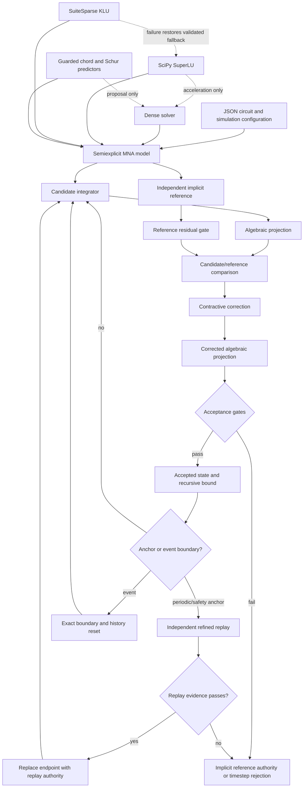

# Bounded-Authority-Based-Circuit-Simulation Architecture

Bounded-Authority-Based-Circuit-Simulation is a supervisory
transient-integration architecture. Candidate methods may propose work, but
independently checked evidence controls acceptance.

## Authority Layers

1. **Model authority:** circuit topology, values, source waveforms, and the
   semiexplicit MNA partition define the equations.
2. **Projection authority:** every accepted candidate endpoint must satisfy the
   algebraic manifold and full residual gates.
3. **Reference authority:** an independently solved implicit method owns shadow
   mode and controls active-mode comparison and fallback.
4. **Bound authority:** contraction, recursive-error, passivity, residual, and
   work caps control whether a candidate can remain active.
5. **Replay authority:** periodic and safety anchors independently replay the
   interval, replace provisional endpoints, and rebuild multistep history.
6. **Release authority:** deterministic tests and artifacts are evidence; exact
   hash human approval controls tagging and publication.

## Acceleration Boundary

Dense, SciPy, KLU, topology caching, batched sensitivity, sparse workspaces,
quartic guesses, chord factors, and Schur updates reduce work. None becomes a
new acceptance authority. Structural mismatch, singularity, residual failure,
line-search failure, or stale evidence restores a validated path or rejects the
step.

## Claim Boundary

BAB-CS reports several distinct numerical bounds. It does not claim exact
indefinite trajectory accuracy, unconditional stability of an explicit method,
or a machine-checked interval proof for the complete nonlinear circuit solver.
See `ERROR_BOUND_MODEL.md`, `BOUNDED_CANDIDATES.md`, and
`VALIDATION_RELEASE_AND_CLAIMS_ESSAY.md` for the detailed boundaries.
