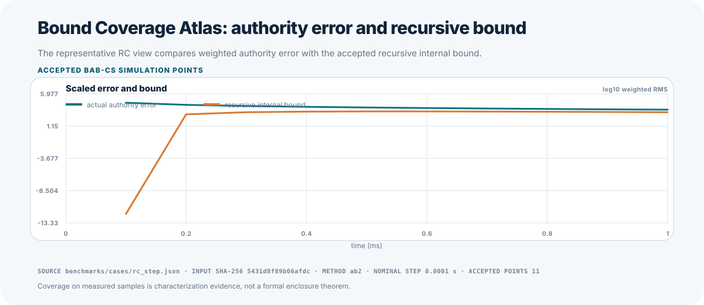
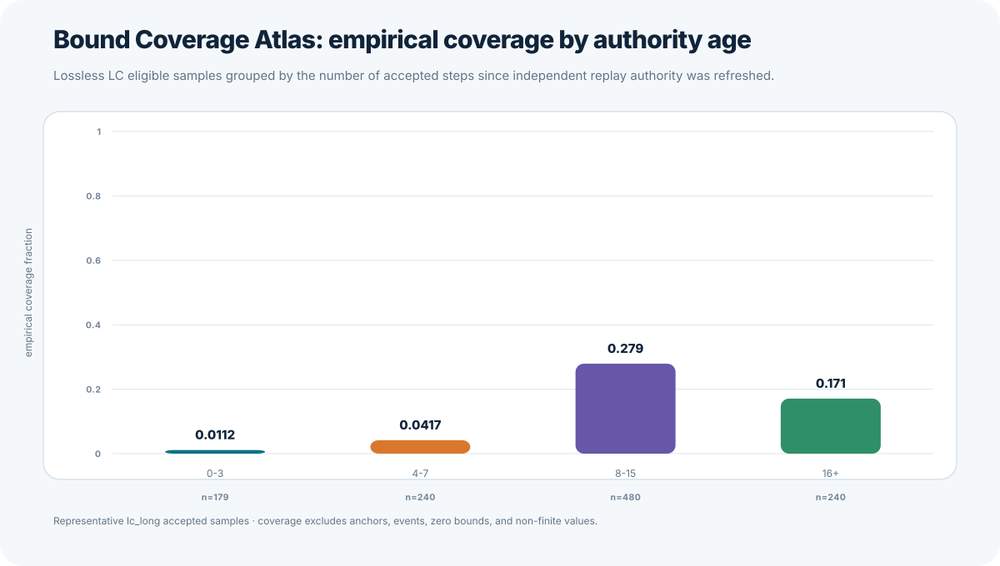
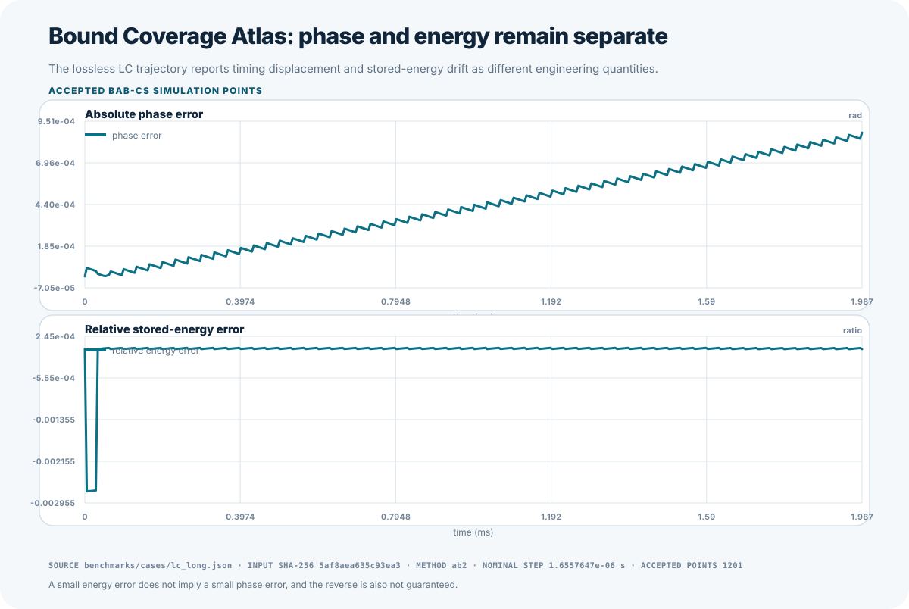
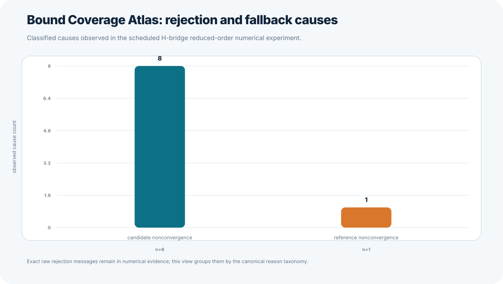

# BAB-CS Bound Coverage Atlas

The Bound Coverage Atlas replays the exact configurations and canonical row IDs
from a Method Observatory report. It aligns analytic or refined-replay authority
at every accepted time and reports the relationship between observed authority
error and BAB-CS internal evidence.

## Metrics

For each accepted bounded step, the atlas reports:

- `actual_authority_error`, the weighted distance from the declared authority;
- `authority_epoch_drift_error`, the weighted trajectory drift since the last
  independent anchor;
- `recursive_internal_bound`, the accepted BAB-CS recursive bound;
- anchor deviation and pre-reset bound;
- phase and energy separately where applicable;
- empirical error-to-bound and bound-to-error ratios;
- fallback, rejection, event, and history-reset causes; and
- requested and suggested steps for each rejected attempt.

Coverage excludes zero-bound, anchor/reset, event, unavailable, and non-finite
samples and counts them separately. The empirical coverage fraction is the
fraction of eligible samples where authority epoch drift does not exceed the
recursive internal bound. This is characterization evidence, not a formal
enclosure theorem or a guarantee against an unknown physical trajectory.

## Run

First generate the Method Observatory report, then run:

```bash
PYTHONPATH=src python tools/bound_coverage_atlas.py \
  --observatory-report artifacts/observatory/numerical.json \
  --output artifacts/bound-atlas/atlas.json \
  --sample-csv artifacts/bound-atlas/samples.csv \
  --plot-directory artifacts/bound-atlas/plots
```

The generator refuses an Observatory report whose source-tree hash differs from
the current source. It replays every exact configuration and requires diagnostic
and deterministic-work reconciliation before producing atlas evidence.

## Anchor Evidence

Every periodic, safety, and event-forced anchor records authority age, pre-reset
bound, provisional-to-replay deviation, actual authority error before and after
replacement, replay subdivisions and retries, replay-native energy evidence,
and final residuals. Event history reset remains distinct from authority refresh.

## Views

The deterministic SVG set contains error versus bound, empirical coverage by
anchor age, phase versus energy, and rejection/fallback cause views. Timing is
not included in atlas evidence.

### Authority Error and Recursive Bound

This representative RC view uses the Atlas weighted root-mean-square scaling.
Weighted root-mean-square means the state differences are normalized by the
declared absolute and relative tolerances before they are combined. The graph
does not convert measured coverage into a mathematical enclosure theorem.



### Empirical Coverage by Authority Age

Authority age is the number of accepted steps since independent replay last
refreshed the retained authority basis. This view groups eligible lossless-LC
samples into the same age buckets used by the Atlas.



### Phase and Energy

Phase error measures timing displacement in the oscillation. Relative energy
error measures numerical gain or loss of stored electrical and magnetic energy.
They remain separate because either measurement can be small while the other is
large.



### Rejection and Fallback Causes

The cause chart groups exact rejection records through the canonical Atlas
reason taxonomy. The representative scheduled H-bridge case exercises
candidate-cap and nonlinear-reference rejection paths; the complete raw
messages remain in the numerical report.


