# BAB-CS Method Observatory

The Method Observatory runs every implemented BAB-CS candidate method on the
canonical RC, RL, damped RLC, lossless LC, diode-clip, and switched-RC cases.
Every case has at least three fixed-step refinements. The complete required
matrix contains 126 rows: six cases, seven bounded candidates, and three steps.

The seven candidate profiles are explicit Euler, Heun, RK23, AB2, backward
Euler, trapezoidal, and BDF2. Each remains supervised by projection, independent
reference authority, correction, hard gates, and replay. Trapezoidal candidates
use BDF2 authority; the other profiles use trapezoidal authority so an implicit
candidate is never compared with an identical local reference method.

## Circuit and Result Figures

Each schematic below is generated from the exact checked-in JSON case. Each
result graph runs that case through the current BAB-CS simulator and plots its
accepted states. The graphs are representative trajectories for understanding
the cases; the full Observatory report remains the authority for the complete
126-row method and refinement matrix.

### RC Step

The resistor-capacitor (`RC`) case applies a one-volt step through a one-kilohm
resistor to a one-microfarad capacitor. The accepted state is the capacitor
voltage, which rises toward the source voltage.

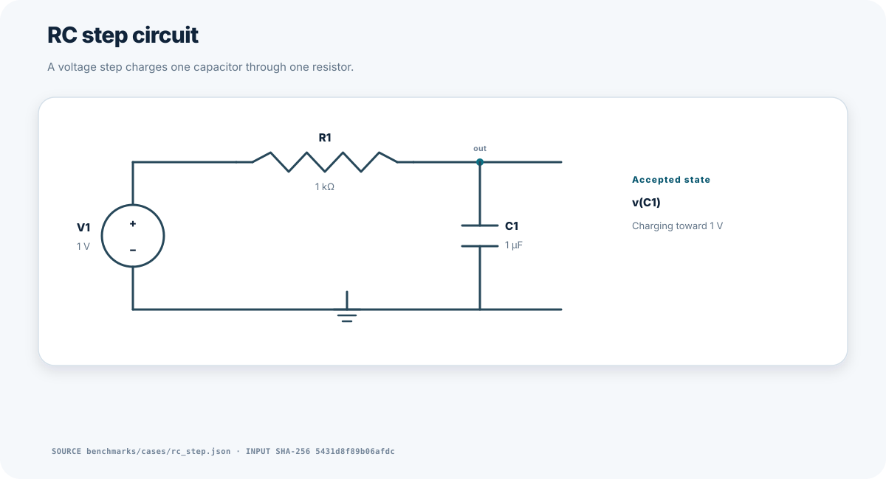

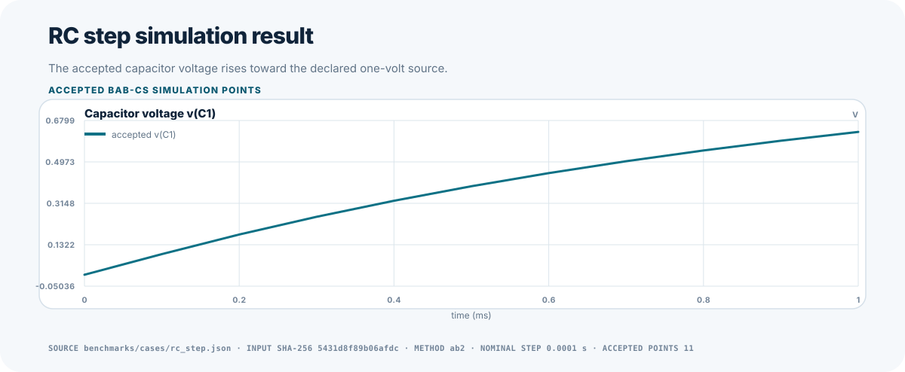

### RL Step

The resistor-inductor (`RL`) case applies a one-volt step to a ten-ohm resistor
and one-millihenry inductor. The accepted state is inductor current, which must
remain continuous while it approaches its steady value.

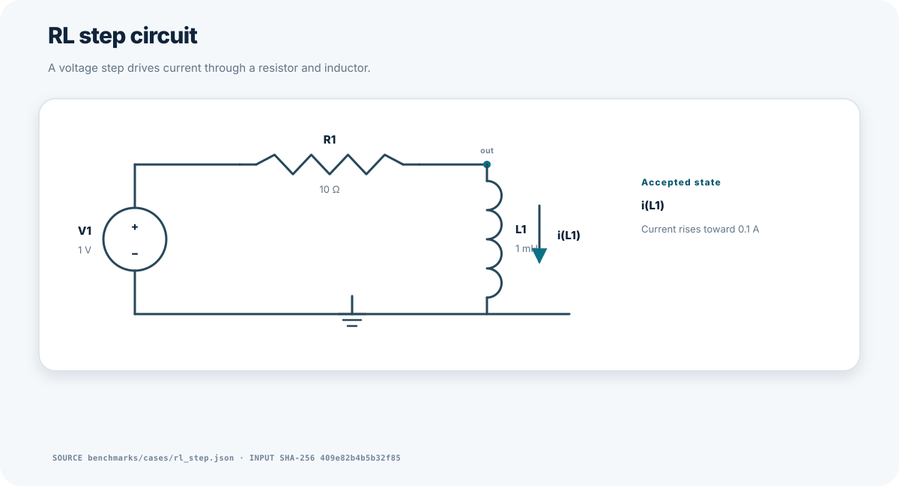

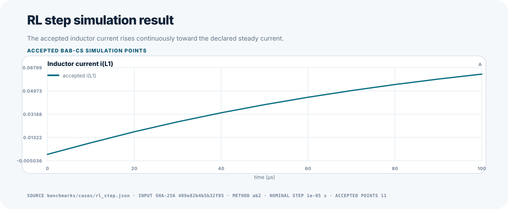

### Damped RLC

The damped resistor-inductor-capacitor (`RLC`) case begins with stored capacitor
energy. Voltage and current oscillate while the declared resistor removes
energy. The graph keeps voltage and current in separate panels because they use
different physical units.

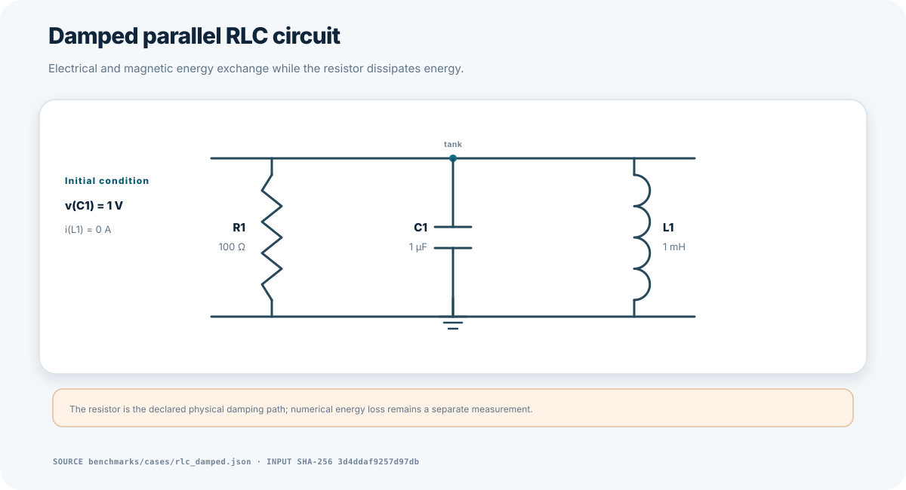

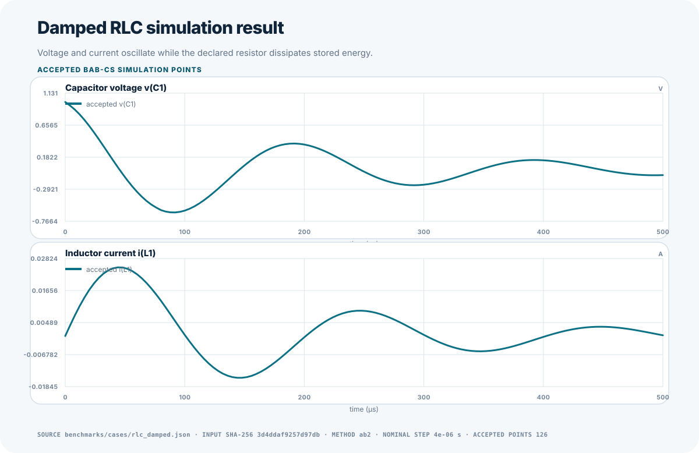

### Lossless LC Long Horizon

The inductor-capacitor (`LC`) case has no declared resistor. Electrical and
magnetic energy exchange for ten periods, making phase drift and stored-energy
drift separately visible.

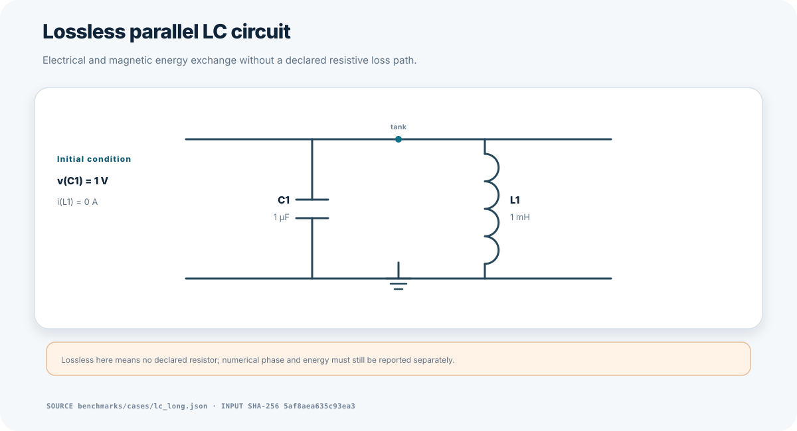

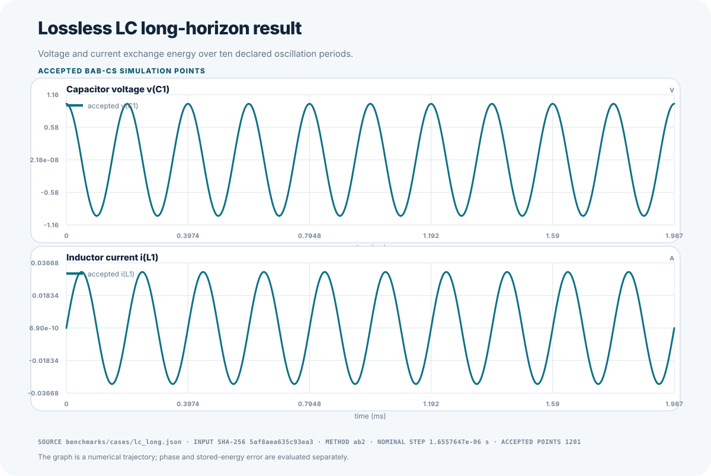

### Diode Clip

The diode-clip case drives an RC output with a sinusoidal source and a Shockley
diode. A Shockley diode is a simplified exponential diode equation used here to
exercise nonlinear convergence and clipping behavior.

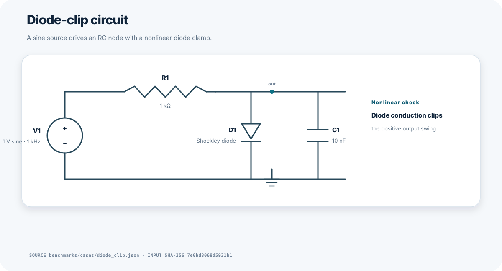

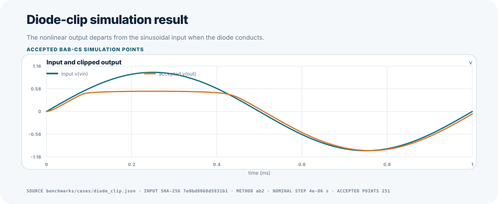

### Switched RC

The switched-RC case adds a scheduled resistive switch across the capacitor.
The switch command repeatedly discharges the output, and every commanded
transition is an exact event boundary rather than an event crossed inside one
timestep.

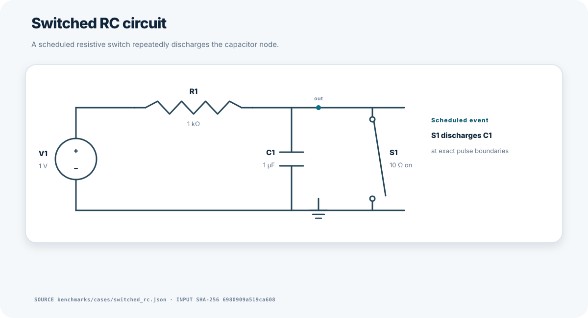

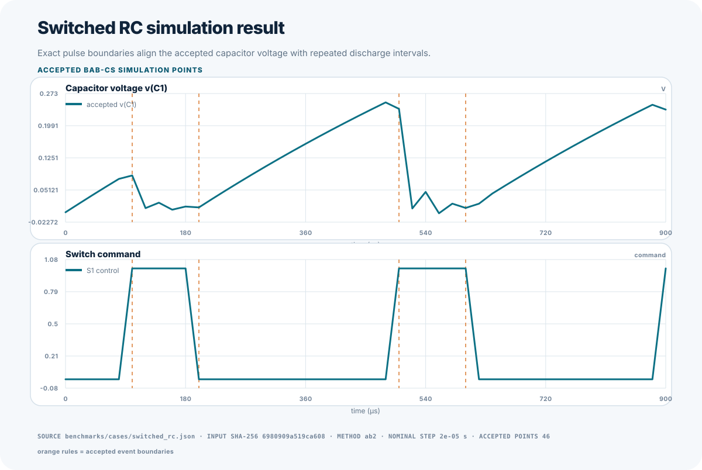

## Run

```bash
PYTHONPATH=src python tools/method_observatory.py \
  --output artifacts/observatory/numerical.json \
  --fixed-step-csv artifacts/observatory/fixed-step.csv \
  --fixed-accuracy-csv artifacts/observatory/fixed-accuracy.csv \
  --fixed-work-csv artifacts/observatory/fixed-work.csv \
  --plot-output artifacts/observatory/accuracy-by-work.svg \
  --markdown-output artifacts/observatory/report.md
```

Use `--case CASE_ID` to select cases and `--quick` to run the first two step
sizes. Add `--timing-repeats N --timing-output PATH` only for separate local
timing characterization.

## Reports

- **Fixed step** preserves every measured configuration and its accuracy,
  internal-bound, phase/energy, robustness, and deterministic-work evidence.
- **Fixed accuracy** selects the least-work measured row that meets a target.
- **Fixed work** selects the smallest-error measured row within a work budget.

Every selected row records its canonical `row_id`. No qualification selection
uses interpolation or extrapolation. `no_qualifying_row` is emitted when the
measured grid does not satisfy a target or budget.

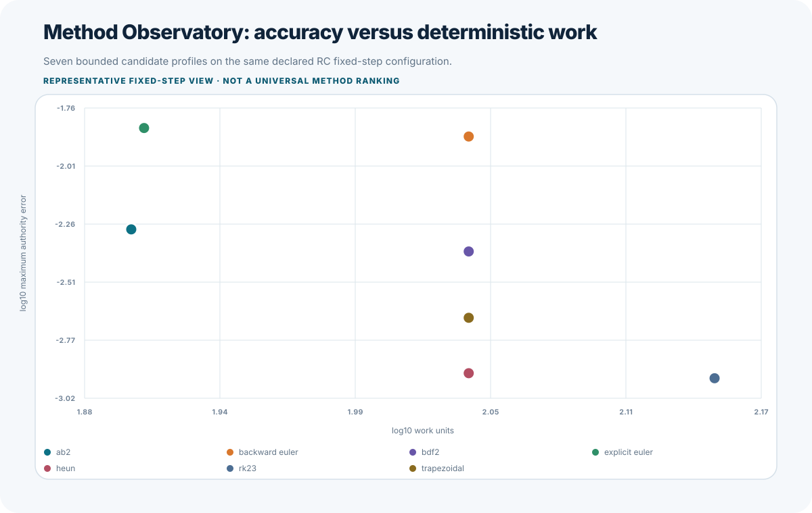

## Claim Boundary

The observatory characterizes the declared cases, configurations, authority,
source tree, and environment. It does not prove that one method is universally
better. Deterministic work is a reproducible counter; elapsed time is separate
machine-local evidence and is not a correctness gate.
