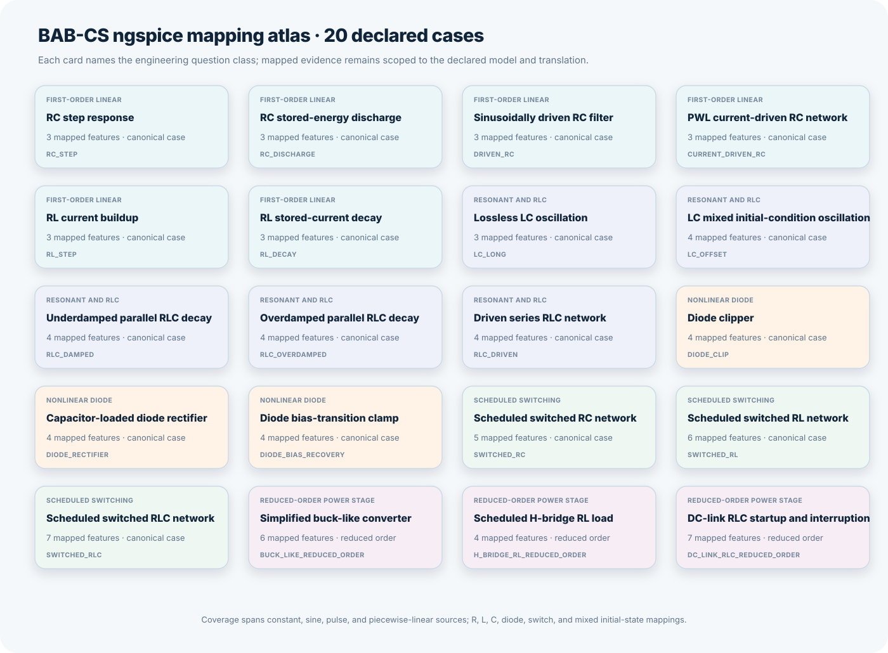
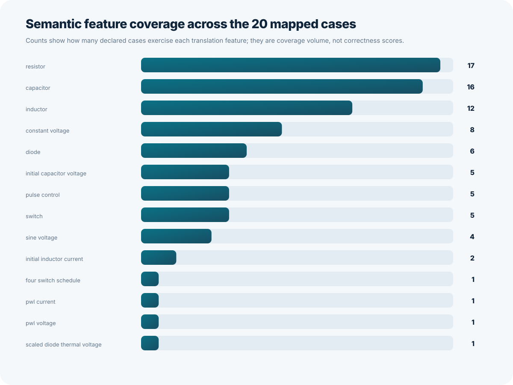

# BAB-CS ngspice 20-Case Mapping Atlas

This atlas documents the 20 cases owned by
`benchmarks/external/manifest.json`. The manifest, not this prose table, is the
authoritative inventory used by the scheduled comparison workflow, the teaching
lab, documentation metrics, and the suite runner.

ngspice is an independent implementation in the Simulation Program with
Integrated Circuit Emphasis (`SPICE`) family. Cross-implementation comparison
can reveal translation defects, state-order defects, event differences, and
nonlinear-solver differences. It is not analytic truth and it is not a
production-device certification tool.



## The Five Case Families

### First-Order Linear Cases

1. **RC step response** checks constant voltage, resistance, capacitance, and a
   zero initial capacitor voltage.
2. **RC stored-energy discharge** checks a nonzero initial capacitor voltage
   without an independent source.
3. **Sinusoidally driven RC filter** checks sine-source amplitude and phase-lag
   behavior.
4. **Piecewise-linear current-driven RC network** checks a current source and a
   piecewise-linear (`PWL`) schedule. Piecewise linear means straight-line
   interpolation between declared time-value points.
5. **RL current buildup** checks a resistor-inductor (`RL`) source transient.
6. **RL stored-current decay** checks a nonzero initial inductor current.

### Resonant and RLC Cases

7. **Lossless LC oscillation** checks phase and energy behavior in an
   inductor-capacitor (`LC`) tank.
8. **LC mixed initial-condition oscillation** checks simultaneous initial
   capacitor voltage and inductor current.
9. **Underdamped parallel RLC decay** checks oscillatory stored-energy decay.
10. **Overdamped parallel RLC decay** checks non-oscillatory decay.
11. **Driven series RLC network** checks simultaneous capacitor-voltage and
    inductor-current comparison under sinusoidal forcing.

### Nonlinear Diode Cases

12. **Diode clipper** checks nonlinear limiting with a sine source.
13. **Capacitor-loaded diode rectifier** checks charging pulses and load
    discharge.
14. **Diode bias-transition clamp** checks recovery after a PWL bias reversal.

### Scheduled Switching Cases

15. **Scheduled switched RC network** checks pulse-controlled resistance and
    exact event boundaries.
16. **Scheduled switched RL network** checks inductor-current continuity and a
    diode freewheel path.
17. **Scheduled switched RLC network** checks event-driven transfer between
    magnetic and electric stored energy.

### Reduced-Order Power-Stage Cases

18. **Simplified buck-like converter** checks a scheduled high-side switch,
    freewheel diode, inductor, capacitor, and resistive load.
19. **Scheduled H-bridge RL load** checks four switch schedules and bipolar load
    current.
20. **Direct-current-link RLC startup and interruption** checks connection,
    interruption, freewheel behavior, and link-energy response.

Direct current (`DC`) means current with a fixed polarity. The three cases in
this family are reduced-order numerical experiments. They are not transistor,
contactor, thermal, fault, protection, or hardware-safety models.

## Mapping Feature Coverage



The coverage graph counts how many cases exercise each mapping feature. A large
count does not prove correctness. It shows how broadly a feature is challenged
by the current inventory.

The mapped device and source surface includes:

- resistors, capacitors, inductors, Shockley diodes, and resistive switches;
- independent voltage and current sources;
- constant, sine, pulse, and PWL waveforms;
- capacitor-voltage and inductor-current initial conditions;
- diode thermal-voltage conversion through ngspice ideality; and
- deterministic state-vector output in BAB-CS canonical order.

## Measured Reference Differences


The reference graph is generated from
`benchmarks/external/reference-results.json`, which records the normalized
metrics from the reviewed ngspice 46 run. The horizontal axis is logarithmic so
that small and large differences remain visible together.

The H-bridge case contains the largest maximum pointwise difference. Its final
current difference is small, while a switched-event neighborhood creates a much
larger maximum. That is an investigation target: the result should lead to
event-by-event inspection, not a hidden average and not an unsupported claim
that either simulator is universally wrong.

## Run and Preserve the Suite

```bash
PYTHONPATH=src python tools/run_external_suite.py \
  benchmarks/external/manifest.json \
  --output-root artifacts/external
```

The command writes four artifacts per case plus `suite.json`: 81 files for the
20-case run. Output refuses overwrite unless `--overwrite` is explicit.

Preserve the report, netlist, raw data, log, manifest, exact source identity,
and SHA-256 fingerprints together. A detached plot without its mapping and
provenance is weaker evidence.

## Claim Boundary

The atlas proves that the repository owns 20 explicit mappings and that the
reviewed live run executed all 20 with ngspice 46. It does not claim exact
physical trajectory error, universal simulator ranking, or production device
fidelity.
