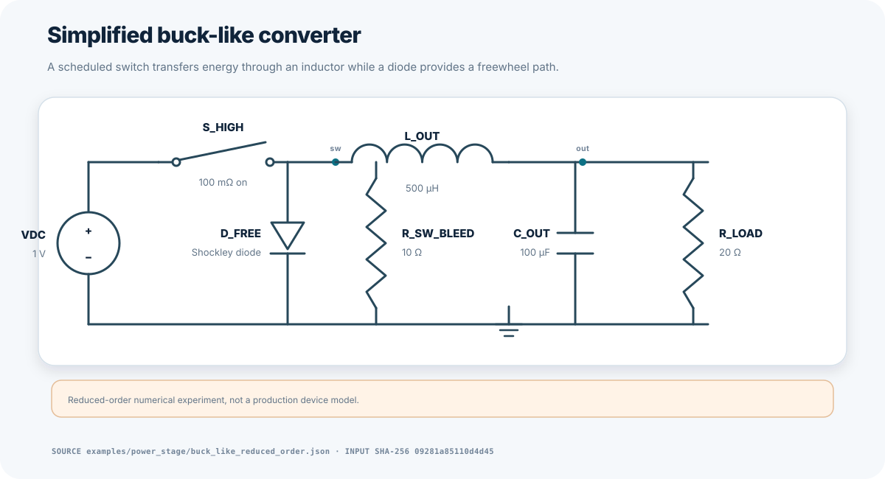
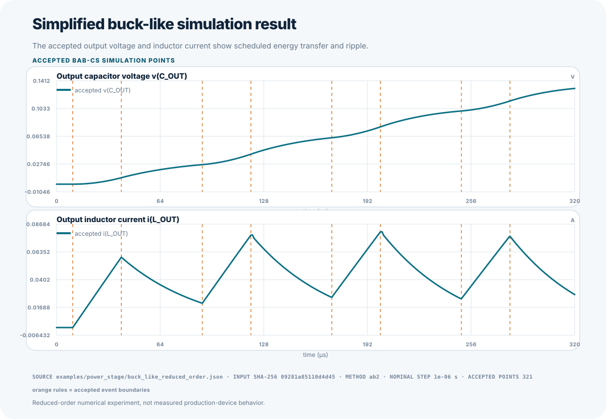
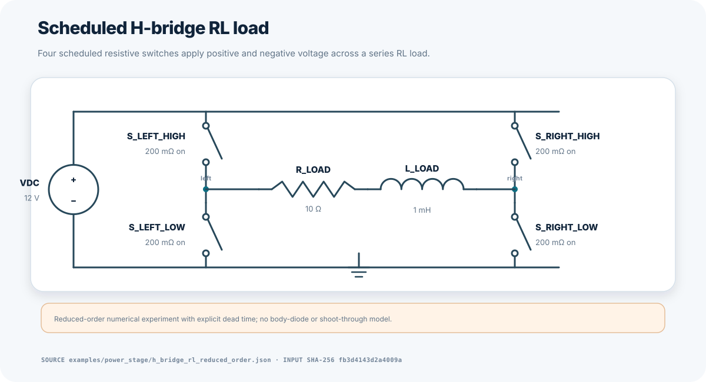
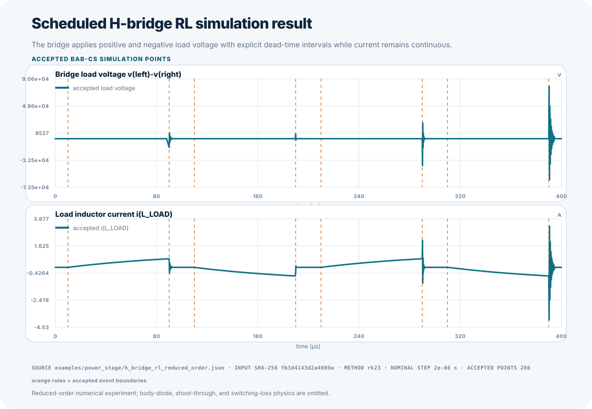
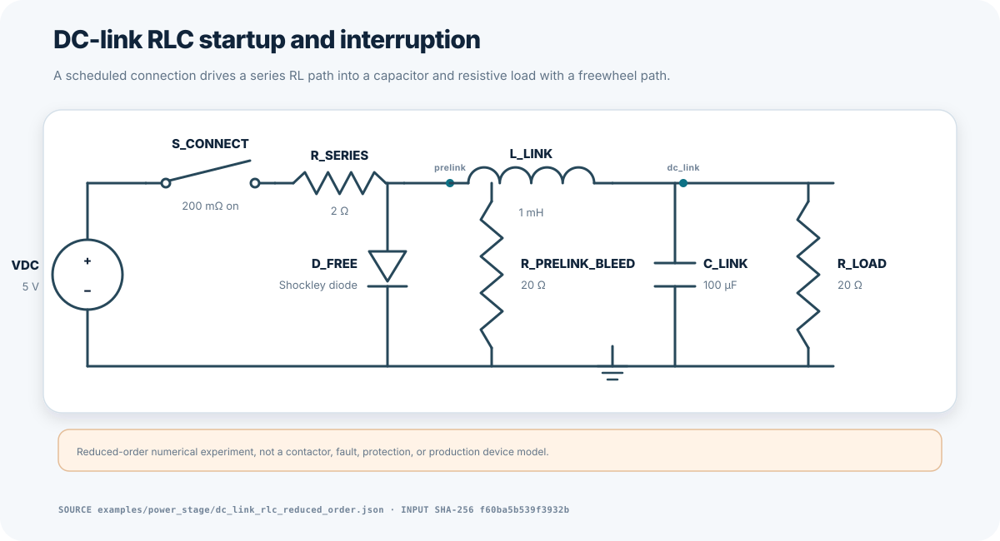
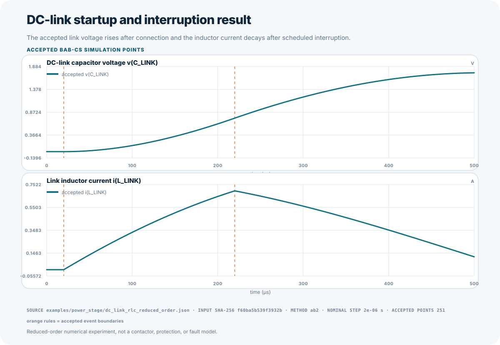

# BAB-CS Power-Stage Sandbox

> These are reduced-order numerical experiments, not production device models.

The Power-Stage Sandbox extends BAB-CS event, authority, passivity, and
determinism evidence without claiming production semiconductor or hardware
fidelity. Every case uses only the currently implemented R, L, C, independent
source, Shockley diode, and scheduled resistive-switch semantics.

## Simplified Buck-Like Converter

`examples/power_stage/buck_like_reduced_order.json` contains a scheduled
high-side resistive switch, freewheel Shockley diode, output inductor,
capacitor, load, and a declared reduced-order switch-node bleed path. It is used
to observe inductor-current continuity, output ripple, diode conduction,
event-forced replay, and energy accounting.





## Scheduled H-Bridge RL Load

`examples/power_stage/h_bridge_rl_reduced_order.json` contains four scheduled
resistive switches, explicit dead-time intervals, midpoint bleed resistors, and
a series RL load. The schedule produces positive and negative load voltage while
forbidding same-leg upper/lower overlap. It does not model body diodes,
shoot-through physics, or gate-driver dynamics.





## DC-Link RLC Startup and Interruption

`examples/power_stage/dc_link_rlc_reduced_order.json` connects a reduced-order
DC source through a scheduled switch and series R-L path to a capacitor/load.
A Shockley freewheel path and declared pre-link bleed resistor support bounded
interruption decay. The case is not a contactor, fault, or protection model.





## Qualification

`benchmarks/power_stage/manifest.json` defines refined trapezoidal authority,
three step refinements, and bounded candidate profiles. Tests require exact
event schedules, event-forced replay with at least eight subdivisions, finite
states and powers, residual and energy caps, deterministic CSV/JSON replay,
H-bridge dead time and polarity reversal, diode conduction, and post-interrupt
energy decay.

Run the comparison profiles with:

```bash
PYTHONPATH=src python tools/compare_methods.py \
  --manifest benchmarks/power_stage/manifest.json \
  --output artifacts/power-stage/numerical.json \
  --csv-output artifacts/power-stage/numerical.csv
```

The evidence remains scoped to the exact reduced-order topology, parameters,
source tree, and declared refined authority.
