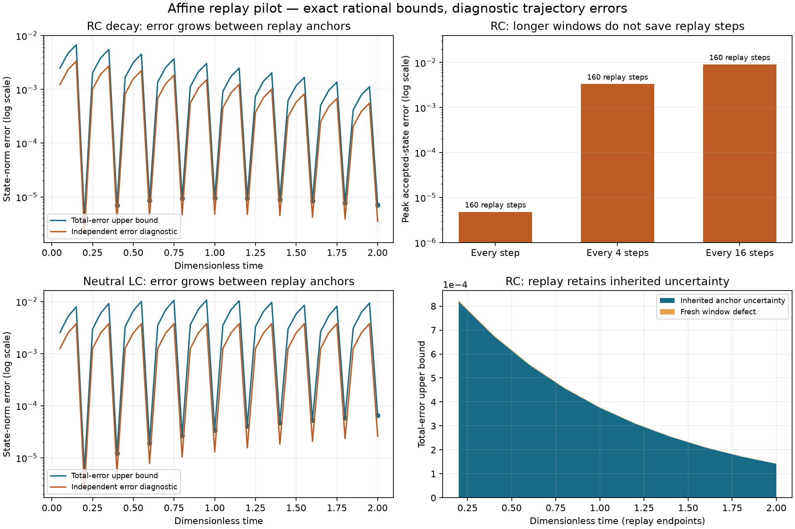

# Affine Replay Error Budget: First Research Result

5 September 2026. [Theorem and proof](REPLAY_ERROR_BUDGET_THEOREM.md) ·
[Executable pilot](../tools/replay_error_budget.py) ·
[Exact numerical evidence](../benchmarks/research/replay-error-budget-pilot-v1.json)

**Finding.** A replay error ledger can preserve a total trajectory-error bound
by separating propagated anchor uncertainty from new replay defect. The scoped
theorem is implemented in a standalone rational-arithmetic pilot. It does not
prove the current production BAB-CS controller correct.

The governing update is

```text
new anchor radius = propagated old anchor radius + accumulated replay defect.
```

The study ran 49 configurations across RC, RL, damped RLC, neutral LC, and an
RC source-switching case. Every recorded accepted-state error from the
independent high-precision diagnostic was below the derived radius. This is
supporting experimental evidence; the mathematical argument and exact
arithmetic provide the proposed certificate, not sampled coverage.

**Replay improves anchor accuracy but does not erase inherited error.** With
h=0.05, refinement four, and replay every four steps, the results are:

| Reduced circuit | Peak accepted-state error, diagnostic | Peak total-error upper bound | Final total-error upper bound |
|---|---:|---:|---:|
| RC decay | 0.003333 | 0.006721 | 0.000007049 |
| RL startup | 0.005909 | 0.012012 | 0.000003816 |
| Damped RLC | 0.006922 | 0.021251 | 0.000081650 |
| Neutral LC | 0.003755 | 0.010627 | 0.000065281 |
| RC scheduled source | 0.003333 | 0.006721 | 0.000009580 |

All values are dimensionless, using the declared scalar infinity or energy
coordinate Euclidean norm. Peak values include provisional accepted steps
between anchors. Final values follow a replay. They are different metrics and
must not be conflated.

For RC decay, supplying an initial uncertainty radius of 0.001 produces a final
radius of approximately 0.000142384. Without initial uncertainty it is
0.000007049. The difference is consistent with the physical decay of the
initial uncertainty, approximately exp(-2)*0.001. A separate constant-dynamics
test proves the ledger retains initial uncertainty exactly even when fresh
replay defect is zero. Resetting the total radius in that case would be wrong.

**Longer replay intervals are not a reference-work saving.** For the same RC
grid and refinement, increasing the interval changes peak error as follows:

| Replay interval | Peak accepted-state error, diagnostic | Replay windows | Fine replay steps | Euler proposal steps |
|---|---:|---:|---:|---:|
| Every step | 0.000004790 | 40 | 160 | 40 |
| Every 4 steps | 0.003333 | 10 | 160 | 40 |
| Every 16 steps | 0.009075 | 3 | 160 | 40 |
| Pure refined trapezoidal baseline | 0.000004790 | 40 advancing blocks | 160 | 0 |

Every elapsed portion of the horizon is still replayed at the same fine
resolution. The pilot demonstrates fewer windows, not fewer implicit steps.
The pure reference baseline reaches the same output-grid states as every-step
replay while omitting Euler proposals. Longer windows might change overhead or
factorization behavior in production, but this experiment measures neither.
It establishes no speedup.

The no-replay Euler control has peak RC error 0.009394 and performs no replay
steps. Its error is also bounded by the defect ledger, with a much larger
radius. This confirms that the theorem accounts for errors without depending
on replay; replay supplies a potentially more accurate replacement trajectory.

**Finer replay improves final accuracy, but may leave peak error unchanged.**
At h=0.05 and a four-step replay interval, RC results are:

| Replay refinement | Final error, diagnostic | Final upper bound | Fine replay steps |
|---|---:|---:|---:|
| 1 | 0.000056399 | 0.000112803 | 40 |
| 2 | 0.000014098 | 0.000028196 | 80 |
| 4 | 0.000003524 | 0.000007049 | 160 |
| 8 | 0.000000881 | 0.000001762 | 320 |

The roughly fourfold improvement on doubling refinement is consistent with
second-order trapezoidal behavior over this tested range. Peak accepted error
remains 0.003333 across these four runs because the early Euler proposals
before the first replay dominate it. Improving replay alone therefore does not
solve whole-trajectory accuracy. Reducing h to 0.025 with refinement four
reduces the peak RC error to 0.0008841 in the tested four-step policy.

**Figures.** Lines connect recorded endpoints for visual guidance; they are not
the cubic Hermite dense reconstruction or an independently sampled continuous
error envelope. Replay endpoints are marked in the left panels. The lower-right
panel distinguishes inherited anchor uncertainty from defect accumulated only
in the current window; inherited uncertainty also includes earlier windows'
numerical error.



[Exportable SVG](../artifacts/replay-error-budget-2026-09-05/replay-error-budget.svg)

**Validation and reproducibility.** All 14 targeted tests pass. They cover
exponential enclosure, neutral/contracting/growing propagation, endpoint
rounding, known scalar errors, energy norms, non-normal matrices, inherited
uncertainty, refinement, scheduled events, and invalid inputs. Repeating the
49-run study produced byte-identical JSON, and all three recorded source hashes
matched the executable, theorem, and tests. The numerical pilot uses only the
Python standard library. Plotting is optional and requires matplotlib.

```bash
python -m unittest discover -s tests -p 'test_replay_error_budget.py' -v
python tools/replay_error_budget.py --output /tmp/replay-error-budget.json
python tools/plot_replay_error_budget.py /tmp/replay-error-budget.json \
  --output-directory /tmp/replay-error-budget-figures
```

Use fresh output paths. No full production, release, or external-comparison
suite was rerun because the implementation adds a separate research tool and
does not change production source. Existing uncommitted work was preserved.

**Next research decision.** The first theorem and experiment support explicit
anchor-error accounting. They do not support a computational advantage for
periodic replay alone. The next study should combine the ledger with higher
order proposals or certified adaptive replay, evaluate whole-trajectory error
at equal work, and integrate one precisely reduced BAB-CS affine circuit.
Nonlinear models, state-triggered timing, certified MNA reduction, and the
previously reported interval underflow defect remain outside this result.
