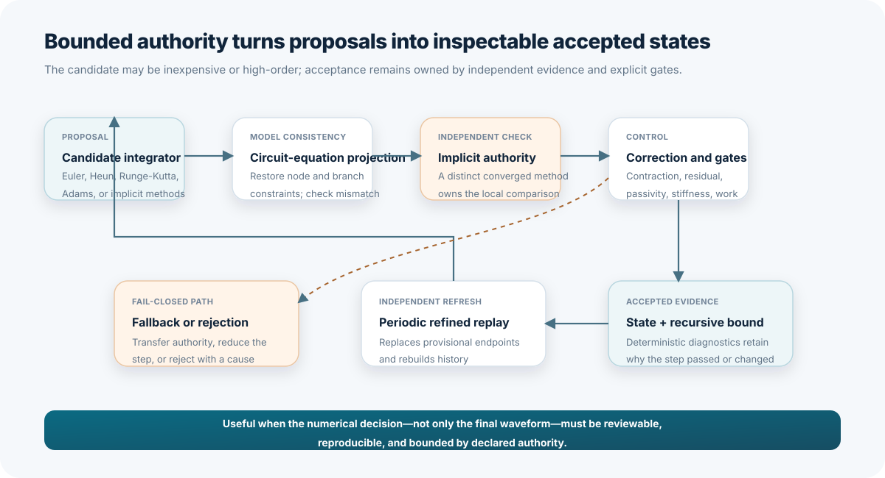
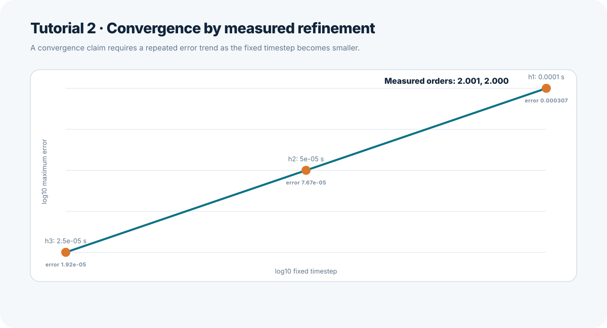
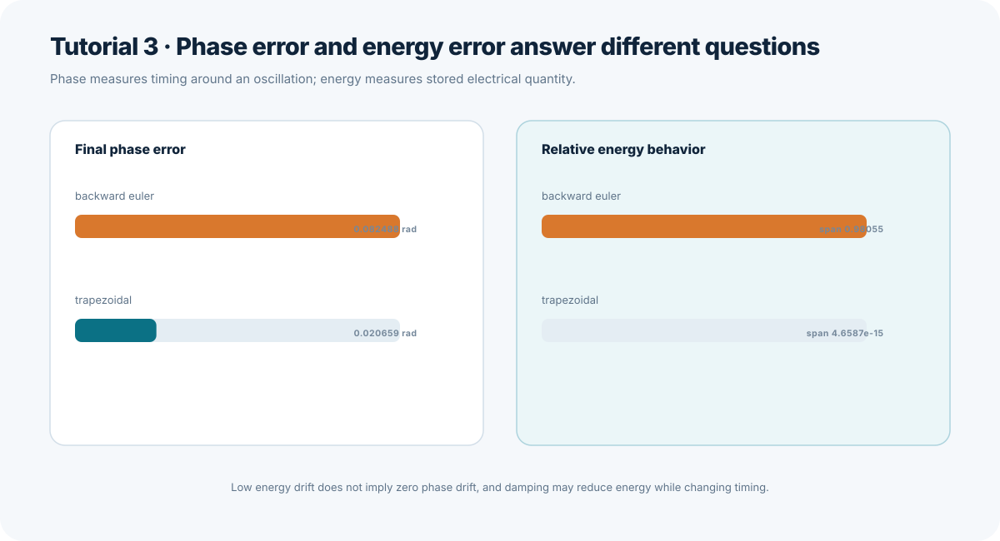
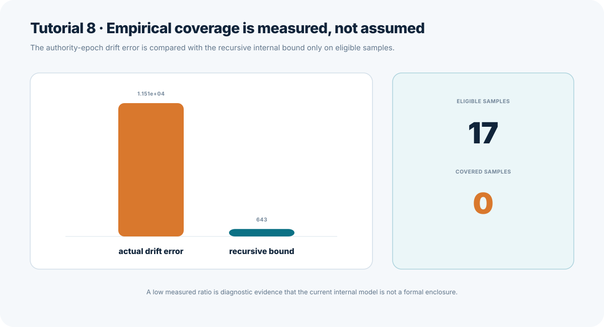
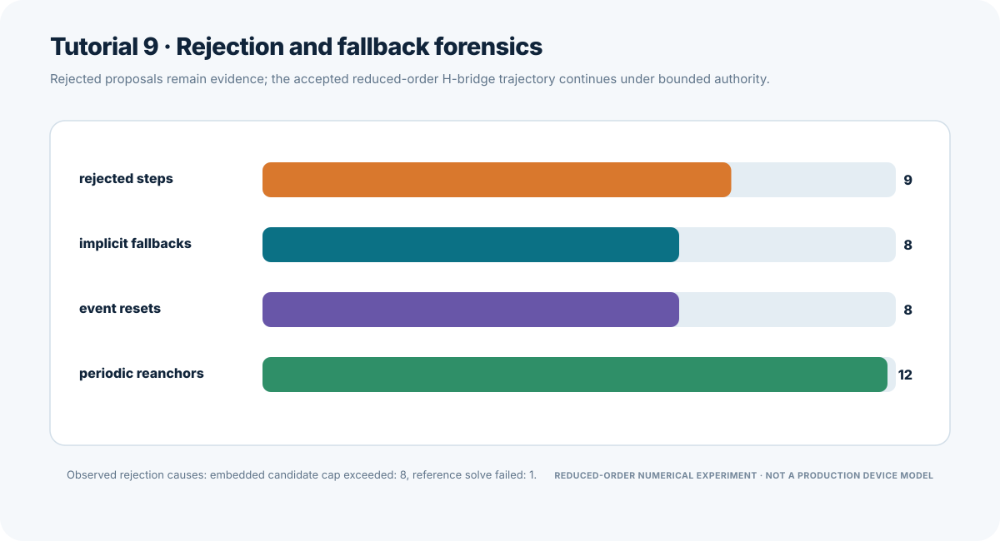
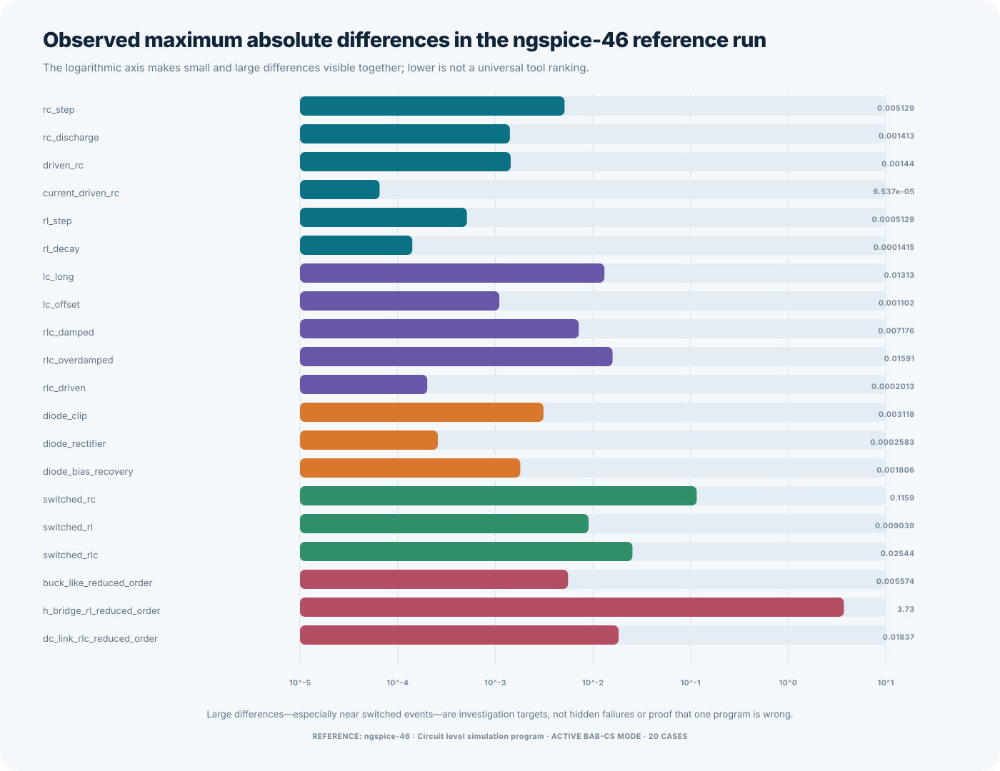

# Scientific Results Report for the Ten BAB-CS Tutorials

**Experiment date:** August 27, 2026
**System under study:** Bounded-Authority-Based-Circuit-Simulation (`BAB-CS`)

## Abstract

This report evaluates ten reproducible tutorials that exercise circuit
formulation, numerical convergence, phase and energy behavior, authority
separation, deterministic packaging, source-versus-package equivalence, event
alignment, empirical bound coverage, rejection forensics, and external
comparison with ngspice. BAB-CS is a circuit-simulation architecture in which a
candidate numerical method may propose the next state, but separate checks
decide whether that state is accepted.

All ten tutorial verifiers completed successfully. Most numerical expectations
were met. The second-order convergence exercise measured orders of
`2.0011734866053392` and `2.000293128382485`. The phase-and-energy exercise
showed that backward Euler dissipated most of the oscillator energy while the
trapezoidal method preserved energy to floating-point precision but retained a
measurable phase error. Deterministic package builds produced identical Secure
Hash Algorithm 256-bit (`SHA-256`) fingerprints, and the selected source and
installed-wheel runs produced identical artifacts.

Two results require special attention. The empirical bound covered `0` of `17`
eligible samples, with the largest measured authority-epoch drift about
`17.904031990116184` times the largest recursive internal bound. The external
ngspice suite completed all `20` mapped cases, but the reduced-order H-bridge
case produced a maximum native-unit difference of `3.730147981349861`. These
results are retained as research findings rather than hidden or converted into
release claims.



## Research Questions

The tutorials address five scientific questions:

1. Does the implemented circuit formulation preserve the intended ownership of
   dynamic states and algebraic unknowns?
2. Do measured refinement, phase, and energy results agree with the known
   mathematical behavior of the tested integration methods?
3. Does BAB-CS preserve a separation between proposal authority and accepted
   state authority, including shadow calculations, fallbacks, and rejections?
4. Can the same declared source produce deterministic packages and equivalent
   source-versus-installed-package results?
5. Do empirical internal-bound and external-simulator comparisons expose both
   agreement and disagreement without overstating what the evidence proves?

## Methods

The primary tutorial suite was executed with:

```bash
PYTHONPATH=src python lab/support/verify.py \
  --exercise all --development \
  --output /tmp/babcs-scientific-tutorials.json
```

The verifier completed all ten exercises and reported `all_passed: true`.
Development mode was used because the working tree contained uncommitted work;
it permits reproducibility experiments without claiming release qualification.

The live external comparison was executed with:

```bash
PYTHONPATH=src python tools/run_external_suite.py \
  benchmarks/external/manifest.json \
  --output-root /tmp/babcs-scientific-ngspice
```

ngspice is an open-source simulator from the Simulation Program with Integrated
Circuit Emphasis (`SPICE`) family. The installed tool identified itself as
`ngspice-46 : Circuit level simulation program`. It completed all `20` cases
and produced `81` retained files, including generated netlists, logs, raw data,
and comparison reports.

The tutorials use deliberately bounded examples. Resistor-capacitor (`RC`),
resistor-inductor (`RL`), inductor-capacitor (`LC`), and
resistor-inductor-capacitor (`RLC`) circuits isolate first-order, oscillatory,
and damped behavior. The buck-like converter, H-bridge RL load, and direct
current (`DC`)-link RLC cases are reduced-order numerical experiments. A
reduced-order experiment intentionally omits device detail that is unnecessary
for the stated numerical question. These cases are not production
semiconductor, protection, thermal, or electromagnetic models.

## Expected Results

The expectations were derived from circuit equations, numerical-method theory,
and the repository's declared evidence contracts.

| Tutorial | Expected result |
| --- | --- |
| 1. Modified nodal analysis | The capacitor voltage is the dynamic state, algebraic variables remain separate, the initial derivative is `1000` volts per second, and the circuit-equation residual is zero within floating-point precision. |
| 2. Convergence by refinement | Halving the step size reduces the error by about four for a second-order method, giving a measured order near two. |
| 3. Phase versus energy | Backward Euler is numerically dissipative. The trapezoidal method preserves oscillator energy much better, but energy preservation does not eliminate phase error. |
| 4. Shadow authority | Enabling a non-authoritative shadow method does not change the accepted state beyond floating-point tolerance, while still producing separate diagnostics. |
| 5. Deterministic packaging | Two builds from the same controlled source and metadata produce byte-identical wheel files and equal SHA-256 fingerprints. A wheel is an installable Python package file. |
| 6. Source versus wheel equivalence | Selected simulations run from the source tree and from an isolated installed wheel produce identical summary and trace artifacts. |
| 7. Event alignment | Every scheduled discontinuity up to the stop time is accepted at its declared time, history is reset at each event, and no step silently crosses an event. |
| 8. Empirical bound coverage | An optimistic conservative-bound hypothesis predicts that most eligible samples are covered. The stricter requirement is honest reporting even if coverage is poor. |
| 9. Fallback and rejection forensics | The scheduled H-bridge challenges the candidate method, produces visible rejections and fallbacks, and still reaches the declared stop time. |
| 10. Semantic ngspice mapping | All 20 cases preserve component meaning and state order. Smooth cases should generally agree more closely than event-dominated or reduced-order switching cases, without assuming either tool is an unquestionable oracle. |

## Actual Results

| Tutorial | Principal measured result | Outcome against expectation |
| --- | --- | --- |
| 1. Modified nodal analysis | One dynamic coordinate, four algebraic coordinates, derivative `1000.0000000000001` volts per second, residual `0.0`. | Matched within floating-point precision. |
| 2. Convergence by refinement | Errors `3.068987885731511e-4`, `7.666231473091312e-5`, and `1.9161684994717376e-5`; orders `2.0011734866053392` and `2.000293128382485`. | Matched second-order theory. |
| 3. Phase versus energy | Backward Euler phase error `0.08248810247463056` radians and energy error/span `0.9805531365134604`; trapezoidal phase error `0.020658618955850548` radians and final energy error `6.352747104407253e-16`. | Matched the expected distinction between phase and energy. |
| 4. Shadow authority | Active-to-shadow accepted-state difference `1.3877787807814457e-17`; tolerance `3.552713678800501e-15`; ratio `0.00390625`. | Matched; no accepted-state authority leak was observed. |
| 5. Deterministic packaging | Two 19-member wheels had the same SHA-256 fingerprint: `ca5d648e60dfd9923deadc85fb304b45dc9ecf87aecc982a369d3766542806f2`. | Matched; release evidence remained false in development mode. |
| 6. Source versus wheel equivalence | Five selected cases had matching summary and trace artifacts; the isolated run confirmed `source_tree_excluded: true`; the observatory smoke artifacts also matched. | Matched the numerical and isolation expectations. |
| 7. Event alignment | Five scheduled events were accepted at `0.0001`, `0.0002`, `0.0005`, `0.0006000000000000001`, and `0.0009000000000000001` seconds; five event resets and four startup steps were recorded. | Matched; the final event coincided with the stop time. |
| 8. Empirical bound coverage | `0` of `17` eligible samples covered; maximum drift `11512.211750693821`; maximum bound `642.995485991595`; ratio `17.904031990116184`; formal enclosure `false`. | The optimistic coverage expectation failed; the reporting-integrity expectation passed. |
| 9. Fallback and rejection forensics | Nine rejected candidate attempts, eight implicit fallbacks, eight event resets, twelve periodic reanchors, and completion at `0.0004` seconds. | Matched the qualitative robustness and evidence-retention expectation. |
| 10. Semantic ngspice mapping | All `20` cases, `14` feature types, and `28` dynamic coordinates mapped and ran. The H-bridge maximum difference was `3.730147981349861`; its root-mean-square difference was `0.23016505280206029`. | Structural expectation passed; the H-bridge difference exceeded a close-agreement expectation. |

Root-mean-square (`RMS`) difference is the square root of the average squared
difference across compared samples. The external maximum differences retain
the native unit of the selected state coordinate. They are not dimensionless
accuracy scores and should not be averaged into a universal ranking across
voltages and currents.

## Detailed Results and Interpretation

### 1. Modified Nodal Analysis and State Ownership

Modified nodal analysis (`MNA`) writes circuit equations in terms of node
voltages, selected branch currents, and energy-storage states. The tutorial
identified capacitor voltage `v(C1)` as the single dynamic state while keeping
node voltages and source current in the algebraic solve.

For a one-volt step across a `1000`-ohm resistor and a `1e-6`-farad capacitor,
the expected initial derivative is:

```text
(1 volt - 0 volts) / (1000 ohms * 1e-6 farads) = 1000 volts per second
```

The observed value, `1000.0000000000001`, differs from the exact decimal result
only because most decimal fractions cannot be represented exactly in binary
floating-point arithmetic. The zero residual shows that the tested equation
ownership and algebraic reconstruction were internally consistent.

### 2. Convergence by Refinement



The step size was halved from `1e-4` to `5e-5` and then to `2.5e-5` seconds. The
measured error ratios were `4.003254919322154` and `4.000812807018167`, close to
the theoretical ratio of four for a second-order method. The corresponding
orders were slightly above two because a finite refinement sequence contains
higher-order error terms and floating-point effects in addition to the leading
second-order term.

The practical conclusion is stronger than a method label alone: this exact
implementation, circuit, interval, norm, and refinement sequence displayed the
expected second-order trend.

### 3. Phase Error Versus Energy Error



Phase error measures how far an oscillation is shifted in time. Energy error
measures how much the computed electrical and magnetic energy differs from its
reference behavior. These quantities answer different questions.

Backward Euler, an implicit first-order method, produced about
`4.726220131838973` degrees of phase error and an energy error/span of
`0.9805531365134604`. The trapezoidal method produced a smaller phase error of
about `1.183651676739196` degrees and preserved final energy to approximately
`6.35e-16` relative error. The trapezoidal result still had nonzero phase error,
confirming that excellent energy behavior cannot be used as a substitute for
timing accuracy.

### 4. Shadow Authority

A shadow method is executed for comparison but is not permitted to approve the
accepted state. The active bounded configuration and the shadow-enabled
configuration each recorded `19` candidate steps, while the independent
authority performed `20` reference solves.

The accepted-state difference was approximately 256 times smaller than the
declared comparison tolerance. The small nonzero value is consistent with
floating-point evaluation and solve ordering. It is not evidence that the
shadow method changed the accepted trajectory.

### 5. Deterministic Packaging

Deterministic packaging means that the same declared source and controlled
metadata produce the same package bytes. Both builds contained `19` members and
had the same SHA-256 fingerprint. The result demonstrates byte-level
repeatability for the measured build path.

The verifier correctly retained `release_evidence: false`. A deterministic
development build is useful evidence, but a dirty working tree is not an
approved release snapshot.

### 6. Source Versus Installed-Wheel Equivalence

The source and installed-wheel runs matched for all five selected cases, and
the isolated wheel process confirmed that it did not import BAB-CS from the
source tree. This separates package behavior from accidental local imports.

One expected difference is provenance rather than simulation output. A report
that records the source-tree fingerprint changes when documentation, tests, or
other tracked source inputs change. That changing report fingerprint is correct
behavior because it preserves source identity; it is not a numerical
source-versus-wheel mismatch.

### 7. Exact Event Alignment

An event is a declared time at which a source or switch schedule changes. The
run accepted all five events exactly as represented by the floating-point time
grid. The long forms `0.0006000000000000001` and
`0.0009000000000000001` are binary floating-point representations of intended
decimal schedule values, not extra physical delays.

The run recorded five history resets but four startup steps because the final
event occurred at the stop time. No subsequent integration step was needed
after that last reset.

### 8. Empirical Bound Coverage



The recursive internal bound is BAB-CS's running estimate of accumulated
modeled numerical error since a trusted anchor. An anchor is a retained
accepted state used to start an independent replay. Authority-epoch drift is
the independently measured difference accumulated since that anchor.

None of the `17` eligible samples satisfied:

```text
authority-epoch drift <= recursive internal bound
```

The largest measured drift was about `17.9` times the largest bound. This
falsifies the optimistic hypothesis that the current bound and configuration
are conservative for this experiment. It does not establish one root cause.
Controlled follow-up should separately test local-to-global error propagation,
anchor-age scaling, omitted error sources, and bound-configuration parameters.

The reporting behavior passed its stricter requirement: the zero coverage was
retained, and no formal enclosure was claimed.

### 9. Fallback and Rejection Forensics



A rejected candidate attempt is a proposal that failed a declared gate. An
implicit fallback transfers authority to a method that solves equations
containing the new state. The two counts need not match one-for-one because a
rejected attempt can be followed by a smaller successful retry, and several
attempts can precede one accepted state.

Eight rejections were attributed to the embedded candidate cap and one to a
reference-solve failure. The simulation still reached `0.0004` seconds through
controlled retries and eight fallbacks. This is evidence of fail-closed
progress: unsuccessful proposals remained visible and were not silently
promoted.

### 10. External Comparison with ngspice



The structural mapper preserved all `20` declared cases and the canonical order
of `28` dynamic coordinates. Smooth first-order cases had maximum native-unit
differences between approximately `6.54e-5` and `5.13e-3`. Scheduled cases were
generally larger, including `0.11593356837261994` for switched RC. The
reduced-order H-bridge had the largest maximum difference,
`3.730147981349861`, although its final absolute error was approximately
`3.02e-9`.

The retained summary does not record the exact time of the maximum H-bridge
difference. Event-step placement, output interpolation, method-specific damping
or phase, and ideal-switch execution are plausible hypotheses, but the present
data cannot select among them. A follow-up experiment should retain the time
and state coordinate of every maximum, then compare traces immediately before
and after each scheduled switch.

## Reasons Expected and Actual Results Differed

The observed departures have different scientific meanings and should not be
combined into one generic error category.

1. **Binary floating-point representation.** Tiny differences in Tutorials 1,
   4, and 7 arise because the computer stores finite binary approximations to
   decimal values and may evaluate equivalent operations in different orders.
2. **Finite refinement and higher-order terms.** Tutorial 2 measured orders
   slightly above two because the theoretical order describes the leading
   behavior as the step size approaches zero, while the experiment uses three
   finite step sizes.
3. **Intrinsic integration-method behavior.** Tutorial 3 differs by design:
   backward Euler adds numerical damping, while trapezoidal integration largely
   preserves oscillator energy but still accumulates phase error.
4. **Evidence identity versus numerical identity.** Tutorial 6 permits a
   provenance-bearing report fingerprint to change when the source snapshot
   changes, even when the compared numerical artifacts remain equal.
5. **Attempts versus accepted steps.** Tutorial 9 recorded nine rejections and
   eight fallbacks because rejection, retry, fallback, and acceptance are
   distinct events rather than one-to-one counters.
6. **Insufficient empirical bound coverage.** Tutorial 8 found that the current
   recursive bound was too small for every eligible measured drift sample. The
   experiment narrows the valid claim but does not by itself prove whether the
   deficiency lies in propagation, scaling, omitted terms, or configuration.
7. **Independent simulator semantics.** Tutorial 10 compares different
   integration, event, interpolation, and nonlinear-solve implementations. The
   H-bridge difference is therefore an investigation target, not proof that one
   simulator is universally correct and the other is wrong.

## Theory and Practical Outcomes

### Theoretical Outcomes

- Dynamic-state ownership can be tested independently from algebraic circuit
  reconstruction.
- Measured convergence order provides implementation evidence that a method
  name alone cannot supply.
- Phase accuracy and energy behavior are independent axes of oscillator
  quality.
- A shadow calculation can produce comparative evidence without receiving
  accepted-state authority.
- Internal error bounds require empirical coverage studies and cannot become
  formal proofs through measurement alone.
- External simulators are most useful as independent falsification tools when
  disagreement remains visible.

### Practical Outcomes

- Engineers can use the tutorials as compact regression experiments when
  changing matrix assembly, integration methods, event handling, packaging, or
  comparison tooling.
- The event and fallback tutorials show how BAB-CS supports auditable
  reduced-order studies of switched systems without silently accepting failed
  proposals.
- The deterministic build and source-wheel exercises support reproducible
  review, distribution, and rollback.
- The zero bound coverage identifies a concrete research priority before the
  internal bound is used for stronger engineering claims.
- The H-bridge difference identifies a specific external-comparison case for
  time-localized investigation.

## Limitations

The evidence is bounded by the declared tutorial inputs, software versions,
step controls, tolerances, and measured environment. The package tests were run
in development mode and do not constitute release qualification. Empirical
coverage is not formal enclosure. ngspice is independent comparison evidence,
not an oracle. The reduced-order power-stage examples do not model production
semiconductor switching, parasitics, thermal limits, magnetic saturation,
protection, electromagnetic interference, or hardware safety.

The external comparison reports the largest difference across native voltage
and current coordinates. Because those coordinates have different units, the
values support case-level diagnosis but not a universal cross-case accuracy
ranking. The retained H-bridge summary also lacks the time and coordinate of
the maximum, limiting causal interpretation.

## Conclusions

The ten tutorials form a coherent scientific evidence set rather than ten
isolated demonstrations. Circuit ownership, second-order refinement, phase and
energy interpretation, shadow separation, deterministic packaging,
source-wheel equivalence, event alignment, and rejection forensics behaved as
expected in the measured runs.

The most important negative result is the empirical bound coverage of `0` from
`17` eligible samples. The correct conclusion is not that BAB-CS has a proven
enclosure, but that the current recursive bound remains diagnostic for this
configuration and requires refinement or a narrower applicability claim. The
largest external discrepancy, the reduced-order H-bridge maximum of
`3.730147981349861`, similarly defines a follow-up investigation rather than a
universal simulator ranking.

BAB-CS is useful because it keeps these distinctions explicit: a candidate may
propose, independent authority may correct or reject, and evidence may reveal
both strengths and limits. The completed tutorials demonstrate that this
architecture supports reproducible engineering investigation while preserving
the reasons a result should—or should not—be trusted.

## Tutorial Sources

1. [Modified nodal analysis and state ownership](tutorials/01_MNA_STATE_OWNERSHIP.md)
2. [Convergence by measured refinement](tutorials/02_CONVERGENCE_BY_REFINEMENT.md)
3. [Phase error versus energy error](tutorials/03_PHASE_VERSUS_ENERGY.md)
4. [Shadow authority](tutorials/04_SHADOW_AUTHORITY.md)
5. [Deterministic packaging](tutorials/05_DETERMINISTIC_PACKAGING.md)
6. [Source versus installed-wheel equivalence](tutorials/06_SOURCE_WHEEL_EQUIVALENCE.md)
7. [Exact event alignment](tutorials/07_EVENT_ALIGNMENT.md)
8. [Empirical bound coverage](tutorials/08_EMPIRICAL_BOUND_COVERAGE.md)
9. [Fallback and rejection forensics](tutorials/09_FALLBACK_AND_REJECTION_FORENSICS.md)
10. [Semantic mapping to ngspice](tutorials/10_SEMANTIC_NGSPICE_MAPPING.md)

## Claim Boundary

This report records measured development evidence from the declared tutorials
and live ngspice suite on August 27, 2026. It does not claim formal numerical
enclosure, exact physical-model truth, production power-device fidelity,
hardware safety, release qualification, certification, or universal
superiority over another simulator.
